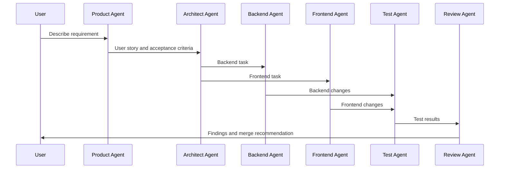

# Workflow: Feature Development

## 目标

从用户需求到代码实现、测试和 Review 的标准多 Agent 流程。

## 流程

## 阶段说明

1. Product Agent 生成用户故事、验收标准、非目标。
2. Architect Agent 判断影响模块、接口、数据库和风险。
3. Backend Agent 实现后端接口和业务逻辑。
4. Frontend Agent 实现页面、状态和 API 对接。
5. Test Agent 补充测试和回归验证。
6. Review Agent 审查代码质量、安全、权限和测试缺口。

## 输出要求

- 需求和验收标准清晰。
- 代码变更范围明确。
- 测试结果可复现。
- Review 结论明确：可合并、修复后合并、阻塞合并。

