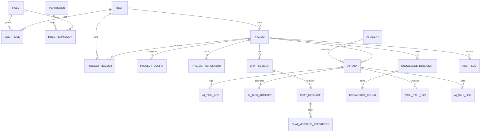

# AI Coding Platform 数据库设计

## 1. 设计目标

本文档定义 AI Coding Platform 第一阶段到第二阶段的核心数据库设计，覆盖用户权限、项目协作、GitHub 仓库、AI Agent、AI 任务、AI Chat、RAG 知识库、审计日志和通知模块。

设计目标：

- 支撑模块化单体架构下的清晰业务边界。
- 支撑后续微服务拆分时按模块迁移数据。
- 支撑项目级数据隔离和权限校验。
- 支撑 AI 调用、工具调用、Git 操作的审计追踪。
- 支撑任务状态流转、执行日志和产物管理。
- 支撑 RAG 文档、Chunk、Embedding 元数据管理。

## 2. 数据库约定

### 2.1 数据库引擎

- 数据库：MySQL 8.x。
- 字符集：`utf8mb4`。
- 排序规则：`utf8mb4_0900_ai_ci`。
- 存储引擎：InnoDB。
- ORM：MyBatis-Plus。
- 迁移工具建议：Flyway 或 Liquibase。

### 2.2 主键策略

建议使用雪花 ID 或 MyBatis-Plus `ASSIGN_ID`：

- 所有业务表主键统一为 `BIGINT`。
- 字段名统一为 `id`。
- 避免使用自增 ID，便于后续分库分表和多服务生成 ID。

### 2.3 通用字段

除关系表或日志表特殊说明外，业务表建议包含以下字段：

| 字段 | 类型 | 说明 |
| --- | --- | --- |
| id | BIGINT | 主键 |
| create_time | DATETIME(3) | 创建时间 |
| update_time | DATETIME(3) | 更新时间 |
| create_by | BIGINT | 创建人 ID |
| update_by | BIGINT | 更新人 ID |
| deleted | TINYINT | 逻辑删除，0 未删除，1 已删除 |
| version | INT | 乐观锁版本 |

### 2.4 状态字段约定

- 状态字段统一使用 `VARCHAR(32)`，便于可读性和后续扩展。
- 枚举值在代码中集中定义，不建议直接使用魔法字符串。
- 时间字段统一使用 `DATETIME(3)`。
- 金额或成本字段使用 `DECIMAL(18, 8)`。
- Token 数量字段使用 `BIGINT`。

### 2.5 外键策略

第一阶段建议不使用数据库物理外键，改由应用层维护关系。

原因：

- 便于模块化单体后续拆分为微服务。
- 避免复杂级联删除造成误删。
- 降低高频写入日志表的锁和约束成本。

要求：

- 所有关联字段必须建立索引。
- 删除主对象时使用逻辑删除或状态归档。
- 应用层必须进行引用完整性校验。

## 3. ER 总览

## 4. 用户与权限表

### 4.1 user 用户表

用途：

- 保存平台用户基础信息、登录信息和用量统计。

| 字段 | 类型 | 约束 | 说明 |
| --- | --- | --- | --- |
| id | BIGINT | PK | 用户 ID |
| username | VARCHAR(64) | NOT NULL | 用户名 |
| email | VARCHAR(128) | NOT NULL | 邮箱 |
| password | VARCHAR(255) | NULL | 加密密码，OAuth 用户可为空 |
| avatar | VARCHAR(512) | NULL | 头像 |
| phone | VARCHAR(32) | NULL | 手机号，预留 |
| status | VARCHAR(32) | NOT NULL | ENABLED、DISABLED、LOCKED |
| github_id | VARCHAR(64) | NULL | GitHub 用户 ID |
| github_login | VARCHAR(128) | NULL | GitHub 登录名 |
| token_usage | BIGINT | NOT NULL DEFAULT 0 | 累计 Token 用量 |
| last_login_time | DATETIME(3) | NULL | 最后登录时间 |
| create_time | DATETIME(3) | NOT NULL | 创建时间 |
| update_time | DATETIME(3) | NOT NULL | 更新时间 |
| create_by | BIGINT | NULL | 创建人 |
| update_by | BIGINT | NULL | 更新人 |
| deleted | TINYINT | NOT NULL DEFAULT 0 | 逻辑删除 |
| version | INT | NOT NULL DEFAULT 0 | 乐观锁 |

索引：

- `uk_user_email`：`email` 唯一。
- `uk_user_username`：`username` 唯一。
- `idx_user_github_id`：`github_id`。
- `idx_user_status`：`status`。

### 4.2 role 角色表

用途：

- 保存平台级角色，例如 Admin、Developer。

| 字段 | 类型 | 约束 | 说明 |
| --- | --- | --- | --- |
| id | BIGINT | PK | 角色 ID |
| code | VARCHAR(64) | NOT NULL | 角色编码 |
| name | VARCHAR(64) | NOT NULL | 角色名称 |
| description | VARCHAR(255) | NULL | 描述 |
| status | VARCHAR(32) | NOT NULL | ENABLED、DISABLED |
| create_time | DATETIME(3) | NOT NULL | 创建时间 |
| update_time | DATETIME(3) | NOT NULL | 更新时间 |
| deleted | TINYINT | NOT NULL DEFAULT 0 | 逻辑删除 |

索引：

- `uk_role_code`：`code` 唯一。

### 4.3 permission 权限表

用途：

- 保存菜单权限、接口权限和操作权限。

| 字段 | 类型 | 约束 | 说明 |
| --- | --- | --- | --- |
| id | BIGINT | PK | 权限 ID |
| code | VARCHAR(128) | NOT NULL | 权限编码 |
| name | VARCHAR(128) | NOT NULL | 权限名称 |
| type | VARCHAR(32) | NOT NULL | MENU、API、ACTION |
| resource | VARCHAR(255) | NULL | 菜单路径或接口路径 |
| method | VARCHAR(16) | NULL | HTTP 方法 |
| parent_id | BIGINT | NULL | 父权限 ID |
| sort_order | INT | NOT NULL DEFAULT 0 | 排序 |
| status | VARCHAR(32) | NOT NULL | ENABLED、DISABLED |
| create_time | DATETIME(3) | NOT NULL | 创建时间 |
| update_time | DATETIME(3) | NOT NULL | 更新时间 |
| deleted | TINYINT | NOT NULL DEFAULT 0 | 逻辑删除 |

索引：

- `uk_permission_code`：`code` 唯一。
- `idx_permission_parent`：`parent_id`。
- `idx_permission_type`：`type`。

### 4.4 user_role 用户角色表

用途：

- 保存用户与平台角色关系。

| 字段 | 类型 | 约束 | 说明 |
| --- | --- | --- | --- |
| id | BIGINT | PK | 主键 |
| user_id | BIGINT | NOT NULL | 用户 ID |
| role_id | BIGINT | NOT NULL | 角色 ID |
| create_time | DATETIME(3) | NOT NULL | 创建时间 |

索引：

- `uk_user_role`：`user_id, role_id` 唯一。
- `idx_user_role_role`：`role_id`。

### 4.5 role_permission 角色权限表

用途：

- 保存角色与权限关系。

| 字段 | 类型 | 约束 | 说明 |
| --- | --- | --- | --- |
| id | BIGINT | PK | 主键 |
| role_id | BIGINT | NOT NULL | 角色 ID |
| permission_id | BIGINT | NOT NULL | 权限 ID |
| create_time | DATETIME(3) | NOT NULL | 创建时间 |

索引：

- `uk_role_permission`：`role_id, permission_id` 唯一。
- `idx_role_permission_permission`：`permission_id`。

### 4.6 github_account GitHub 账号表

用途：

- 保存用户绑定的 GitHub 账号和授权信息。

| 字段 | 类型 | 约束 | 说明 |
| --- | --- | --- | --- |
| id | BIGINT | PK | 主键 |
| user_id | BIGINT | NOT NULL | 用户 ID |
| github_id | VARCHAR(64) | NOT NULL | GitHub 用户 ID |
| login | VARCHAR(128) | NOT NULL | GitHub Login |
| avatar_url | VARCHAR(512) | NULL | GitHub 头像 |
| access_token_enc | TEXT | NOT NULL | 加密后的 Access Token |
| scope | VARCHAR(512) | NULL | 授权范围 |
| status | VARCHAR(32) | NOT NULL | BOUND、REVOKED |
| bind_time | DATETIME(3) | NOT NULL | 绑定时间 |
| create_time | DATETIME(3) | NOT NULL | 创建时间 |
| update_time | DATETIME(3) | NOT NULL | 更新时间 |

索引：

- `uk_github_account_user`：`user_id` 唯一。
- `uk_github_account_github_id`：`github_id` 唯一。

## 5. 项目与成员表

### 5.1 project 项目表

用途：

- 保存项目基础信息，是平台核心业务边界。

| 字段 | 类型 | 约束 | 说明 |
| --- | --- | --- | --- |
| id | BIGINT | PK | 项目 ID |
| name | VARCHAR(128) | NOT NULL | 项目名称 |
| description | TEXT | NULL | 项目描述 |
| icon | VARCHAR(512) | NULL | 项目图标 |
| owner_id | BIGINT | NOT NULL | 项目负责人 |
| repo_url | VARCHAR(512) | NULL | 仓库地址冗余 |
| tech_stack | VARCHAR(512) | NULL | 技术栈描述 |
| status | VARCHAR(32) | NOT NULL | ACTIVE、ARCHIVED、DELETED |
| create_time | DATETIME(3) | NOT NULL | 创建时间 |
| update_time | DATETIME(3) | NOT NULL | 更新时间 |
| create_by | BIGINT | NOT NULL | 创建人 |
| update_by | BIGINT | NULL | 更新人 |
| deleted | TINYINT | NOT NULL DEFAULT 0 | 逻辑删除 |
| version | INT | NOT NULL DEFAULT 0 | 乐观锁 |

索引：

- `idx_project_owner`：`owner_id`。
- `idx_project_status`：`status`。
- `idx_project_create_time`：`create_time`。

### 5.2 project_member 项目成员表

用途：

- 保存项目成员和项目级角色。

| 字段 | 类型 | 约束 | 说明 |
| --- | --- | --- | --- |
| id | BIGINT | PK | 主键 |
| project_id | BIGINT | NOT NULL | 项目 ID |
| user_id | BIGINT | NOT NULL | 用户 ID |
| role | VARCHAR(32) | NOT NULL | OWNER、MAINTAINER、DEVELOPER、VIEWER |
| status | VARCHAR(32) | NOT NULL | ACTIVE、REMOVED |
| joined_time | DATETIME(3) | NOT NULL | 加入时间 |
| create_time | DATETIME(3) | NOT NULL | 创建时间 |
| update_time | DATETIME(3) | NOT NULL | 更新时间 |

索引：

- `uk_project_member`：`project_id, user_id` 唯一。
- `idx_project_member_user`：`user_id`。
- `idx_project_member_role`：`project_id, role`。

### 5.3 project_invitation 项目邀请表

用途：

- 保存项目成员邀请记录。

| 字段 | 类型 | 约束 | 说明 |
| --- | --- | --- | --- |
| id | BIGINT | PK | 主键 |
| project_id | BIGINT | NOT NULL | 项目 ID |
| email | VARCHAR(128) | NOT NULL | 被邀请邮箱 |
| invitee_user_id | BIGINT | NULL | 被邀请用户 ID |
| inviter_id | BIGINT | NOT NULL | 邀请人 |
| role | VARCHAR(32) | NOT NULL | 邀请角色 |
| token | VARCHAR(128) | NOT NULL | 邀请 Token |
| status | VARCHAR(32) | NOT NULL | PENDING、ACCEPTED、EXPIRED、CANCELED |
| expire_time | DATETIME(3) | NOT NULL | 过期时间 |
| create_time | DATETIME(3) | NOT NULL | 创建时间 |
| update_time | DATETIME(3) | NOT NULL | 更新时间 |

索引：

- `uk_project_invitation_token`：`token` 唯一。
- `idx_project_invitation_project`：`project_id, status`。
- `idx_project_invitation_email`：`email`。

### 5.4 project_config 项目配置表

用途：

- 保存项目级模型、Memory、RAG 和执行配置。

| 字段 | 类型 | 约束 | 说明 |
| --- | --- | --- | --- |
| id | BIGINT | PK | 主键 |
| project_id | BIGINT | NOT NULL | 项目 ID |
| config_key | VARCHAR(128) | NOT NULL | 配置键 |
| config_value | JSON | NOT NULL | 配置值 |
| description | VARCHAR(255) | NULL | 描述 |
| create_time | DATETIME(3) | NOT NULL | 创建时间 |
| update_time | DATETIME(3) | NOT NULL | 更新时间 |
| create_by | BIGINT | NULL | 创建人 |
| update_by | BIGINT | NULL | 更新人 |

索引：

- `uk_project_config_key`：`project_id, config_key` 唯一。

## 6. 仓库与 Git 表

### 6.1 project_repository 项目仓库表

用途：

- 保存项目绑定的代码仓库信息。

| 字段 | 类型 | 约束 | 说明 |
| --- | --- | --- | --- |
| id | BIGINT | PK | 主键 |
| project_id | BIGINT | NOT NULL | 项目 ID |
| provider | VARCHAR(32) | NOT NULL | GITHUB、GITLAB、GITEE |
| repo_full_name | VARCHAR(255) | NOT NULL | 仓库全名，如 owner/repo |
| repo_url | VARCHAR(512) | NOT NULL | 仓库地址 |
| clone_url | VARCHAR(512) | NOT NULL | Clone URL |
| default_branch | VARCHAR(128) | NULL | 默认分支 |
| local_path | VARCHAR(512) | NULL | 服务端工作区路径 |
| status | VARCHAR(32) | NOT NULL | BOUND、CLONING、READY、FAILED、DISABLED |
| last_sync_time | DATETIME(3) | NULL | 最近同步时间 |
| create_time | DATETIME(3) | NOT NULL | 创建时间 |
| update_time | DATETIME(3) | NOT NULL | 更新时间 |
| create_by | BIGINT | NOT NULL | 创建人 |
| update_by | BIGINT | NULL | 更新人 |

索引：

- `uk_project_repository`：`project_id` 唯一。
- `idx_project_repository_provider`：`provider, repo_full_name`。
- `idx_project_repository_status`：`status`。

### 6.2 repository_branch 仓库分支表

用途：

- 缓存仓库分支列表和最近同步信息。

| 字段 | 类型 | 约束 | 说明 |
| --- | --- | --- | --- |
| id | BIGINT | PK | 主键 |
| project_id | BIGINT | NOT NULL | 项目 ID |
| repository_id | BIGINT | NOT NULL | 仓库 ID |
| branch_name | VARCHAR(128) | NOT NULL | 分支名 |
| commit_hash | VARCHAR(128) | NULL | 分支最新 Commit |
| protected_branch | TINYINT | NOT NULL DEFAULT 0 | 是否保护分支 |
| last_sync_time | DATETIME(3) | NULL | 最近同步时间 |
| create_time | DATETIME(3) | NOT NULL | 创建时间 |
| update_time | DATETIME(3) | NOT NULL | 更新时间 |

索引：

- `uk_repository_branch`：`repository_id, branch_name` 唯一。
- `idx_repository_branch_project`：`project_id`。

### 6.3 git_operation_log Git 操作日志表

用途：

- 记录 Clone、Pull、Commit、Push、PR 等 Git 操作。

| 字段 | 类型 | 约束 | 说明 |
| --- | --- | --- | --- |
| id | BIGINT | PK | 主键 |
| project_id | BIGINT | NOT NULL | 项目 ID |
| repository_id | BIGINT | NULL | 仓库 ID |
| task_id | BIGINT | NULL | 关联任务 |
| user_id | BIGINT | NOT NULL | 操作用户 |
| operation_type | VARCHAR(32) | NOT NULL | CLONE、PULL、BRANCH、COMMIT、PUSH、PR |
| branch | VARCHAR(128) | NULL | 分支 |
| commit_hash | VARCHAR(128) | NULL | Commit Hash |
| pr_url | VARCHAR(512) | NULL | PR 地址 |
| status | VARCHAR(32) | NOT NULL | PENDING、RUNNING、SUCCESS、FAILED |
| message | TEXT | NULL | 操作信息 |
| error_message | TEXT | NULL | 失败原因 |
| start_time | DATETIME(3) | NULL | 开始时间 |
| end_time | DATETIME(3) | NULL | 结束时间 |
| create_time | DATETIME(3) | NOT NULL | 创建时间 |

索引：

- `idx_git_log_project_time`：`project_id, create_time`。
- `idx_git_log_task`：`task_id`。
- `idx_git_log_user`：`user_id`。
- `idx_git_log_status`：`status`。

## 7. Agent 与模型表

### 7.1 ai_agent Agent 表

用途：

- 保存 Agent 基础定义。

| 字段 | 类型 | 约束 | 说明 |
| --- | --- | --- | --- |
| id | BIGINT | PK | Agent ID |
| name | VARCHAR(128) | NOT NULL | Agent 名称 |
| code | VARCHAR(64) | NOT NULL | Agent 编码 |
| type | VARCHAR(64) | NOT NULL | ARCHITECT、BACKEND、FRONTEND、TEST、REVIEW、DEVOPS |
| description | VARCHAR(255) | NULL | 描述 |
| avatar | VARCHAR(512) | NULL | Agent 头像 |
| status | VARCHAR(32) | NOT NULL | ENABLED、DISABLED |
| create_time | DATETIME(3) | NOT NULL | 创建时间 |
| update_time | DATETIME(3) | NOT NULL | 更新时间 |
| deleted | TINYINT | NOT NULL DEFAULT 0 | 逻辑删除 |

索引：

- `uk_ai_agent_code`：`code` 唯一。
- `idx_ai_agent_type`：`type`。
- `idx_ai_agent_status`：`status`。

### 7.2 ai_agent_version Agent 版本表

用途：

- 保存 Agent Prompt、模型、工具权限等版本化配置。

| 字段 | 类型 | 约束 | 说明 |
| --- | --- | --- | --- |
| id | BIGINT | PK | 主键 |
| agent_id | BIGINT | NOT NULL | Agent ID |
| version_no | VARCHAR(32) | NOT NULL | 版本号 |
| model_config_id | BIGINT | NULL | 默认模型配置 |
| system_prompt | MEDIUMTEXT | NOT NULL | 系统 Prompt |
| tool_policy | JSON | NULL | 工具权限策略 |
| execution_policy | JSON | NULL | 执行策略 |
| status | VARCHAR(32) | NOT NULL | DRAFT、PUBLISHED、DISABLED |
| publish_time | DATETIME(3) | NULL | 发布时间 |
| create_time | DATETIME(3) | NOT NULL | 创建时间 |
| update_time | DATETIME(3) | NOT NULL | 更新时间 |
| create_by | BIGINT | NULL | 创建人 |
| update_by | BIGINT | NULL | 更新人 |

索引：

- `uk_agent_version`：`agent_id, version_no` 唯一。
- `idx_agent_version_status`：`agent_id, status`。

### 7.3 model_config 模型配置表

用途：

- 保存模型供应商、模型名称、参数和加密 API Key。

| 字段 | 类型 | 约束 | 说明 |
| --- | --- | --- | --- |
| id | BIGINT | PK | 主键 |
| provider | VARCHAR(64) | NOT NULL | OPENAI、CLAUDE、DEEPSEEK、GEMINI、QWEN |
| model_name | VARCHAR(128) | NOT NULL | 模型名称 |
| model_type | VARCHAR(32) | NOT NULL | CHAT、EMBEDDING、RERANK |
| api_base | VARCHAR(512) | NULL | API Base URL |
| api_key_enc | TEXT | NULL | 加密后的 API Key |
| default_params | JSON | NULL | 默认模型参数 |
| status | VARCHAR(32) | NOT NULL | ENABLED、DISABLED |
| create_time | DATETIME(3) | NOT NULL | 创建时间 |
| update_time | DATETIME(3) | NOT NULL | 更新时间 |
| create_by | BIGINT | NULL | 创建人 |
| update_by | BIGINT | NULL | 更新人 |

索引：

- `idx_model_provider_type`：`provider, model_type`。
- `idx_model_status`：`status`。

### 7.4 project_agent_config 项目 Agent 配置表

用途：

- 保存项目启用的 Agent 及其覆盖配置。

| 字段 | 类型 | 约束 | 说明 |
| --- | --- | --- | --- |
| id | BIGINT | PK | 主键 |
| project_id | BIGINT | NOT NULL | 项目 ID |
| agent_id | BIGINT | NOT NULL | Agent ID |
| agent_version_id | BIGINT | NULL | Agent 版本 ID |
| model_config_id | BIGINT | NULL | 项目级覆盖模型 |
| enabled | TINYINT | NOT NULL DEFAULT 1 | 是否启用 |
| config_json | JSON | NULL | 覆盖配置 |
| create_time | DATETIME(3) | NOT NULL | 创建时间 |
| update_time | DATETIME(3) | NOT NULL | 更新时间 |

索引：

- `uk_project_agent`：`project_id, agent_id` 唯一。
- `idx_project_agent_agent`：`agent_id`。

## 8. AI 任务表

### 8.1 ai_task 任务表

用途：

- 保存 AI 任务主数据。

| 字段 | 类型 | 约束 | 说明 |
| --- | --- | --- | --- |
| id | BIGINT | PK | 任务 ID |
| project_id | BIGINT | NOT NULL | 项目 ID |
| title | VARCHAR(255) | NOT NULL | 任务标题 |
| description | MEDIUMTEXT | NULL | 任务描述 |
| task_type | VARCHAR(64) | NOT NULL | CHAT、CODING、REVIEW、RAG_INDEX、DEVOPS |
| agent_id | BIGINT | NULL | 指派 Agent |
| agent_version_id | BIGINT | NULL | 执行时 Agent 版本 |
| creator_id | BIGINT | NOT NULL | 创建人 |
| assignee_id | BIGINT | NULL | 负责人 |
| status | VARCHAR(32) | NOT NULL | PENDING、RUNNING、REVIEWING、COMPLETED、FAILED、CANCELED |
| priority | VARCHAR(32) | NOT NULL | LOW、MEDIUM、HIGH、URGENT |
| source_type | VARCHAR(32) | NULL | MANUAL、CHAT、PR、SCHEDULE |
| source_id | BIGINT | NULL | 来源对象 ID |
| branch | VARCHAR(128) | NULL | 目标分支 |
| retry_count | INT | NOT NULL DEFAULT 0 | 重试次数 |
| max_retry_count | INT | NOT NULL DEFAULT 3 | 最大重试次数 |
| start_time | DATETIME(3) | NULL | 开始时间 |
| end_time | DATETIME(3) | NULL | 结束时间 |
| due_time | DATETIME(3) | NULL | 截止时间 |
| error_message | TEXT | NULL | 失败原因 |
| create_time | DATETIME(3) | NOT NULL | 创建时间 |
| update_time | DATETIME(3) | NOT NULL | 更新时间 |
| deleted | TINYINT | NOT NULL DEFAULT 0 | 逻辑删除 |
| version | INT | NOT NULL DEFAULT 0 | 乐观锁 |

索引：

- `idx_ai_task_project_status`：`project_id, status`。
- `idx_ai_task_project_time`：`project_id, create_time`。
- `idx_ai_task_agent_status`：`agent_id, status`。
- `idx_ai_task_creator`：`creator_id`。
- `idx_ai_task_source`：`source_type, source_id`。

### 8.2 ai_task_log 任务日志表

用途：

- 保存 AI 任务执行过程日志。

| 字段 | 类型 | 约束 | 说明 |
| --- | --- | --- | --- |
| id | BIGINT | PK | 日志 ID |
| task_id | BIGINT | NOT NULL | 任务 ID |
| project_id | BIGINT | NOT NULL | 项目 ID |
| level | VARCHAR(16) | NOT NULL | DEBUG、INFO、WARN、ERROR |
| stage | VARCHAR(64) | NULL | 执行阶段 |
| message | MEDIUMTEXT | NOT NULL | 日志内容 |
| metadata | JSON | NULL | 附加信息 |
| create_time | DATETIME(3) | NOT NULL | 创建时间 |

索引：

- `idx_task_log_task_time`：`task_id, create_time`。
- `idx_task_log_project_time`：`project_id, create_time`。
- `idx_task_log_level`：`level`。

### 8.3 ai_task_artifact 任务产物表

用途：

- 保存任务输出产物，例如 Patch、报告、生成文件、测试结果。

| 字段 | 类型 | 约束 | 说明 |
| --- | --- | --- | --- |
| id | BIGINT | PK | 产物 ID |
| task_id | BIGINT | NOT NULL | 任务 ID |
| project_id | BIGINT | NOT NULL | 项目 ID |
| artifact_type | VARCHAR(32) | NOT NULL | TEXT、PATCH、FILE、REPORT、TEST_RESULT、PR |
| name | VARCHAR(255) | NOT NULL | 产物名称 |
| content | MEDIUMTEXT | NULL | 文本内容 |
| file_url | VARCHAR(512) | NULL | 文件地址 |
| metadata | JSON | NULL | 元数据 |
| create_time | DATETIME(3) | NOT NULL | 创建时间 |

索引：

- `idx_task_artifact_task`：`task_id`。
- `idx_task_artifact_project`：`project_id, create_time`。
- `idx_task_artifact_type`：`artifact_type`。

### 8.4 ai_task_event 任务事件表

用途：

- 保存任务状态流转事件，用于审计和时间线展示。

| 字段 | 类型 | 约束 | 说明 |
| --- | --- | --- | --- |
| id | BIGINT | PK | 事件 ID |
| task_id | BIGINT | NOT NULL | 任务 ID |
| project_id | BIGINT | NOT NULL | 项目 ID |
| from_status | VARCHAR(32) | NULL | 原状态 |
| to_status | VARCHAR(32) | NOT NULL | 新状态 |
| event_type | VARCHAR(64) | NOT NULL | CREATED、STARTED、FAILED、RETRIED、CANCELED、COMPLETED |
| operator_id | BIGINT | NULL | 操作人，系统操作可为空 |
| reason | VARCHAR(512) | NULL | 原因 |
| create_time | DATETIME(3) | NOT NULL | 创建时间 |

索引：

- `idx_task_event_task_time`：`task_id, create_time`。
- `idx_task_event_project_time`：`project_id, create_time`。

## 9. Chat 表

### 9.1 chat_session 会话表

用途：

- 保存单聊、项目群聊、AI 群聊等会话。

| 字段 | 类型 | 约束 | 说明 |
| --- | --- | --- | --- |
| id | BIGINT | PK | 会话 ID |
| project_id | BIGINT | NOT NULL | 项目 ID |
| title | VARCHAR(255) | NULL | 会话标题 |
| session_type | VARCHAR(32) | NOT NULL | SINGLE、PROJECT、AGENT_GROUP |
| creator_id | BIGINT | NOT NULL | 创建人 |
| status | VARCHAR(32) | NOT NULL | ACTIVE、ARCHIVED |
| last_message_time | DATETIME(3) | NULL | 最近消息时间 |
| create_time | DATETIME(3) | NOT NULL | 创建时间 |
| update_time | DATETIME(3) | NOT NULL | 更新时间 |
| deleted | TINYINT | NOT NULL DEFAULT 0 | 逻辑删除 |

索引：

- `idx_chat_session_project_time`：`project_id, last_message_time`。
- `idx_chat_session_creator`：`creator_id`。

### 9.2 chat_message 消息表

用途：

- 保存用户、AI Agent 和系统消息。

| 字段 | 类型 | 约束 | 说明 |
| --- | --- | --- | --- |
| id | BIGINT | PK | 消息 ID |
| project_id | BIGINT | NOT NULL | 项目 ID |
| session_id | BIGINT | NOT NULL | 会话 ID |
| sender_id | BIGINT | NULL | 发送人 ID，AI 或系统可为空 |
| sender_type | VARCHAR(32) | NOT NULL | USER、AGENT、SYSTEM |
| agent_id | BIGINT | NULL | Agent ID |
| task_id | BIGINT | NULL | 关联任务 ID |
| message_type | VARCHAR(32) | NOT NULL | TEXT、MARKDOWN、CODE、TOOL_RESULT、ERROR |
| content | MEDIUMTEXT | NOT NULL | 消息内容 |
| status | VARCHAR(32) | NOT NULL | STREAMING、COMPLETED、FAILED、CANCELED |
| token_usage | BIGINT | NOT NULL DEFAULT 0 | 本消息 Token 用量 |
| metadata | JSON | NULL | 模型、耗时、上下文摘要等 |
| create_time | DATETIME(3) | NOT NULL | 创建时间 |
| update_time | DATETIME(3) | NOT NULL | 更新时间 |

索引：

- `idx_chat_message_session_time`：`session_id, create_time`。
- `idx_chat_message_project_time`：`project_id, create_time`。
- `idx_chat_message_task`：`task_id`。

### 9.3 chat_message_reference 消息引用表

用途：

- 保存 AI 消息引用的文档、代码片段、任务产物等来源。

| 字段 | 类型 | 约束 | 说明 |
| --- | --- | --- | --- |
| id | BIGINT | PK | 主键 |
| message_id | BIGINT | NOT NULL | 消息 ID |
| project_id | BIGINT | NOT NULL | 项目 ID |
| reference_type | VARCHAR(32) | NOT NULL | DOCUMENT、CODE、TASK、URL |
| reference_id | BIGINT | NULL | 引用对象 ID |
| title | VARCHAR(255) | NULL | 标题 |
| url | VARCHAR(512) | NULL | 链接 |
| file_path | VARCHAR(512) | NULL | 文件路径 |
| start_line | INT | NULL | 起始行 |
| end_line | INT | NULL | 结束行 |
| score | DECIMAL(10, 6) | NULL | 相似度分数 |
| snippet | TEXT | NULL | 引用片段 |
| create_time | DATETIME(3) | NOT NULL | 创建时间 |

索引：

- `idx_message_reference_message`：`message_id`。
- `idx_message_reference_project`：`project_id`。

## 10. 知识库与 RAG 表

### 10.1 knowledge_document 知识库文档表

用途：

- 保存上传文档、同步代码文件和解析状态。

| 字段 | 类型 | 约束 | 说明 |
| --- | --- | --- | --- |
| id | BIGINT | PK | 文档 ID |
| project_id | BIGINT | NOT NULL | 项目 ID |
| uploader_id | BIGINT | NULL | 上传人 |
| source_type | VARCHAR(32) | NOT NULL | UPLOAD、REPOSITORY、TASK |
| file_name | VARCHAR(255) | NOT NULL | 文件名 |
| file_type | VARCHAR(64) | NOT NULL | PDF、WORD、MARKDOWN、CODE、TEXT |
| file_path | VARCHAR(512) | NULL | 原始路径 |
| file_url | VARCHAR(512) | NULL | 对象存储地址 |
| content_hash | VARCHAR(128) | NULL | 内容 Hash |
| file_size | BIGINT | NULL | 文件大小 |
| parse_status | VARCHAR(32) | NOT NULL | PENDING、PARSING、INDEXED、FAILED |
| chunk_count | INT | NOT NULL DEFAULT 0 | Chunk 数量 |
| error_message | TEXT | NULL | 解析失败原因 |
| create_time | DATETIME(3) | NOT NULL | 创建时间 |
| update_time | DATETIME(3) | NOT NULL | 更新时间 |
| deleted | TINYINT | NOT NULL DEFAULT 0 | 逻辑删除 |

索引：

- `idx_knowledge_document_project`：`project_id, create_time`。
- `idx_knowledge_document_status`：`project_id, parse_status`。
- `idx_knowledge_document_hash`：`project_id, content_hash`。

### 10.2 knowledge_chunk 知识库 Chunk 表

用途：

- 保存 Chunk 元数据和文本内容，向量本体可保存在 Vector DB。

| 字段 | 类型 | 约束 | 说明 |
| --- | --- | --- | --- |
| id | BIGINT | PK | Chunk ID |
| project_id | BIGINT | NOT NULL | 项目 ID |
| document_id | BIGINT | NOT NULL | 文档 ID |
| chunk_index | INT | NOT NULL | Chunk 序号 |
| chunk_type | VARCHAR(32) | NOT NULL | TEXT、CODE、TITLE、TABLE |
| title | VARCHAR(255) | NULL | 标题 |
| content | MEDIUMTEXT | NOT NULL | Chunk 内容 |
| content_hash | VARCHAR(128) | NULL | 内容 Hash |
| language | VARCHAR(64) | NULL | 代码语言 |
| file_path | VARCHAR(512) | NULL | 文件路径 |
| symbol_name | VARCHAR(255) | NULL | 函数、类、组件名 |
| start_line | INT | NULL | 起始行 |
| end_line | INT | NULL | 结束行 |
| vector_id | VARCHAR(128) | NULL | 向量库 ID |
| metadata | JSON | NULL | 额外元数据 |
| create_time | DATETIME(3) | NOT NULL | 创建时间 |

索引：

- `idx_knowledge_chunk_document`：`document_id, chunk_index`。
- `idx_knowledge_chunk_project`：`project_id`。
- `idx_knowledge_chunk_file`：`project_id, file_path`。
- `idx_knowledge_chunk_symbol`：`project_id, symbol_name`。
- `idx_knowledge_chunk_vector`：`vector_id`。

### 10.3 knowledge_index_job 索引任务表

用途：

- 保存文档解析和向量化任务状态。

| 字段 | 类型 | 约束 | 说明 |
| --- | --- | --- | --- |
| id | BIGINT | PK | 主键 |
| project_id | BIGINT | NOT NULL | 项目 ID |
| document_id | BIGINT | NOT NULL | 文档 ID |
| job_type | VARCHAR(32) | NOT NULL | PARSE、EMBED、REINDEX |
| status | VARCHAR(32) | NOT NULL | PENDING、RUNNING、SUCCESS、FAILED |
| retry_count | INT | NOT NULL DEFAULT 0 | 重试次数 |
| error_message | TEXT | NULL | 失败原因 |
| start_time | DATETIME(3) | NULL | 开始时间 |
| end_time | DATETIME(3) | NULL | 结束时间 |
| create_time | DATETIME(3) | NOT NULL | 创建时间 |
| update_time | DATETIME(3) | NOT NULL | 更新时间 |

索引：

- `idx_index_job_project_status`：`project_id, status`。
- `idx_index_job_document`：`document_id`。

## 11. Memory 表

### 11.1 project_memory 项目记忆表

用途：

- 保存项目长期记忆、开发约定、架构决策和业务规则。

| 字段 | 类型 | 约束 | 说明 |
| --- | --- | --- | --- |
| id | BIGINT | PK | Memory ID |
| project_id | BIGINT | NOT NULL | 项目 ID |
| memory_type | VARCHAR(32) | NOT NULL | RULE、DECISION、SUMMARY、PREFERENCE、FACT |
| title | VARCHAR(255) | NOT NULL | 标题 |
| content | MEDIUMTEXT | NOT NULL | 内容 |
| source_type | VARCHAR(32) | NULL | CHAT、TASK、MANUAL、PR |
| source_id | BIGINT | NULL | 来源 ID |
| confidence | DECIMAL(5, 4) | NULL | 可信度 |
| confirmed | TINYINT | NOT NULL DEFAULT 0 | 是否人工确认 |
| vector_id | VARCHAR(128) | NULL | 向量库 ID |
| status | VARCHAR(32) | NOT NULL | ACTIVE、ARCHIVED |
| create_time | DATETIME(3) | NOT NULL | 创建时间 |
| update_time | DATETIME(3) | NOT NULL | 更新时间 |
| create_by | BIGINT | NULL | 创建人 |

索引：

- `idx_project_memory_project_type`：`project_id, memory_type`。
- `idx_project_memory_source`：`source_type, source_id`。
- `idx_project_memory_vector`：`vector_id`。

## 12. AI 调用与工具调用日志表

### 12.1 ai_call_log AI 调用日志表

用途：

- 记录模型调用、Token、耗时、成本和错误。

| 字段 | 类型 | 约束 | 说明 |
| --- | --- | --- | --- |
| id | BIGINT | PK | 主键 |
| project_id | BIGINT | NULL | 项目 ID |
| task_id | BIGINT | NULL | 任务 ID |
| session_id | BIGINT | NULL | 会话 ID |
| message_id | BIGINT | NULL | 消息 ID |
| agent_id | BIGINT | NULL | Agent ID |
| user_id | BIGINT | NULL | 触发用户 |
| provider | VARCHAR(64) | NOT NULL | 模型供应商 |
| model_name | VARCHAR(128) | NOT NULL | 模型名称 |
| call_type | VARCHAR(32) | NOT NULL | CHAT、EMBEDDING、RERANK |
| prompt_tokens | BIGINT | NOT NULL DEFAULT 0 | 输入 Token |
| completion_tokens | BIGINT | NOT NULL DEFAULT 0 | 输出 Token |
| total_tokens | BIGINT | NOT NULL DEFAULT 0 | 总 Token |
| cost | DECIMAL(18, 8) | NULL | 估算成本 |
| latency_ms | BIGINT | NULL | 耗时 |
| status | VARCHAR(32) | NOT NULL | SUCCESS、FAILED、CANCELED |
| error_code | VARCHAR(64) | NULL | 错误码 |
| error_message | TEXT | NULL | 错误信息 |
| request_summary | JSON | NULL | 请求摘要，需脱敏 |
| response_summary | JSON | NULL | 响应摘要，需脱敏 |
| create_time | DATETIME(3) | NOT NULL | 创建时间 |

索引：

- `idx_ai_call_project_time`：`project_id, create_time`。
- `idx_ai_call_task`：`task_id`。
- `idx_ai_call_user_time`：`user_id, create_time`。
- `idx_ai_call_model_time`：`provider, model_name, create_time`。
- `idx_ai_call_status`：`status`。

### 12.2 tool_call_log 工具调用日志表

用途：

- 记录 Agent 调用文件、Git、测试、RAG、DevOps 等工具的过程。

| 字段 | 类型 | 约束 | 说明 |
| --- | --- | --- | --- |
| id | BIGINT | PK | 主键 |
| project_id | BIGINT | NOT NULL | 项目 ID |
| task_id | BIGINT | NULL | 任务 ID |
| agent_id | BIGINT | NULL | Agent ID |
| user_id | BIGINT | NULL | 触发用户 |
| tool_name | VARCHAR(128) | NOT NULL | 工具名称 |
| tool_type | VARCHAR(64) | NOT NULL | FILE、GIT、TEST、RAG、DEVOPS、NOTIFY |
| input_summary | JSON | NULL | 输入摘要，需脱敏 |
| output_summary | JSON | NULL | 输出摘要，需脱敏 |
| status | VARCHAR(32) | NOT NULL | SUCCESS、FAILED、REJECTED、TIMEOUT |
| latency_ms | BIGINT | NULL | 耗时 |
| error_message | TEXT | NULL | 失败原因 |
| require_approval | TINYINT | NOT NULL DEFAULT 0 | 是否需要审批 |
| approved_by | BIGINT | NULL | 审批人 |
| approved_time | DATETIME(3) | NULL | 审批时间 |
| create_time | DATETIME(3) | NOT NULL | 创建时间 |

索引：

- `idx_tool_call_project_time`：`project_id, create_time`。
- `idx_tool_call_task`：`task_id`。
- `idx_tool_call_tool`：`tool_type, tool_name`。
- `idx_tool_call_status`：`status`。

## 13. 审计与通知表

### 13.1 audit_log 审计日志表

用途：

- 记录用户关键操作和安全敏感事件。

| 字段 | 类型 | 约束 | 说明 |
| --- | --- | --- | --- |
| id | BIGINT | PK | 主键 |
| project_id | BIGINT | NULL | 项目 ID |
| user_id | BIGINT | NULL | 操作用户 |
| action | VARCHAR(128) | NOT NULL | 操作编码 |
| target_type | VARCHAR(64) | NULL | 目标类型 |
| target_id | BIGINT | NULL | 目标 ID |
| ip | VARCHAR(64) | NULL | IP 地址 |
| user_agent | VARCHAR(512) | NULL | User-Agent |
| before_value | JSON | NULL | 修改前，需脱敏 |
| after_value | JSON | NULL | 修改后，需脱敏 |
| result | VARCHAR(32) | NOT NULL | SUCCESS、FAILED |
| error_message | TEXT | NULL | 失败原因 |
| create_time | DATETIME(3) | NOT NULL | 创建时间 |

索引：

- `idx_audit_project_time`：`project_id, create_time`。
- `idx_audit_user_time`：`user_id, create_time`。
- `idx_audit_action_time`：`action, create_time`。
- `idx_audit_target`：`target_type, target_id`。

### 13.2 notification 通知表

用途：

- 保存站内通知、审批提醒和任务状态通知。

| 字段 | 类型 | 约束 | 说明 |
| --- | --- | --- | --- |
| id | BIGINT | PK | 通知 ID |
| user_id | BIGINT | NOT NULL | 接收用户 |
| project_id | BIGINT | NULL | 项目 ID |
| type | VARCHAR(64) | NOT NULL | TASK、APPROVAL、PR、SYSTEM |
| title | VARCHAR(255) | NOT NULL | 标题 |
| content | TEXT | NULL | 内容 |
| link_url | VARCHAR(512) | NULL | 跳转链接 |
| read_status | VARCHAR(32) | NOT NULL | UNREAD、READ |
| read_time | DATETIME(3) | NULL | 阅读时间 |
| create_time | DATETIME(3) | NOT NULL | 创建时间 |

索引：

- `idx_notification_user_status`：`user_id, read_status, create_time`。
- `idx_notification_project`：`project_id, create_time`。

## 14. 关键枚举

### 14.1 项目角色

| 枚举 | 说明 |
| --- | --- |
| OWNER | 项目负责人 |
| MAINTAINER | 维护者 |
| DEVELOPER | 开发成员 |
| VIEWER | 只读成员 |

### 14.2 任务状态

| 枚举 | 说明 |
| --- | --- |
| PENDING | 待处理 |
| RUNNING | 执行中 |
| REVIEWING | Review 中 |
| COMPLETED | 已完成 |
| FAILED | 已失败 |
| CANCELED | 已取消 |

### 14.3 Agent 类型

| 枚举 | 说明 |
| --- | --- |
| ARCHITECT | 架构师 Agent |
| BACKEND | 后端 Agent |
| FRONTEND | 前端 Agent |
| TEST | 测试 Agent |
| REVIEW | Code Review Agent |
| DEVOPS | DevOps Agent |

### 14.4 工具调用状态

| 枚举 | 说明 |
| --- | --- |
| SUCCESS | 成功 |
| FAILED | 失败 |
| REJECTED | 权限或审批拒绝 |
| TIMEOUT | 超时 |

## 15. 高频查询与索引设计

### 15.1 我的项目列表

查询条件：

- `project_member.user_id = ?`
- `project.status = ACTIVE`

索引：

- `project_member(user_id)`
- `project(id, status)`

### 15.2 项目任务列表

查询条件：

- `ai_task.project_id = ?`
- 可选 `status`
- 按 `create_time` 倒序

索引：

- `ai_task(project_id, status)`
- `ai_task(project_id, create_time)`

### 15.3 任务日志流

查询条件：

- `ai_task_log.task_id = ?`
- 按 `create_time` 升序

索引：

- `ai_task_log(task_id, create_time)`

### 15.4 聊天消息列表

查询条件：

- `chat_message.session_id = ?`
- 按 `create_time` 升序或倒序分页

索引：

- `chat_message(session_id, create_time)`

### 15.5 AI 用量统计

查询条件：

- 按 `project_id`、`user_id`、`provider`、`model_name`、`create_time` 统计。

索引：

- `ai_call_log(project_id, create_time)`
- `ai_call_log(user_id, create_time)`
- `ai_call_log(provider, model_name, create_time)`

### 15.6 RAG 检索过滤

查询条件：

- `project_id`
- 可选 `file_path`、`symbol_name`
- 向量库侧也必须按 `project_id` 过滤。

索引：

- `knowledge_chunk(project_id, file_path)`
- `knowledge_chunk(project_id, symbol_name)`
- Vector DB payload index：`project_id`。

## 16. 数据量与分表建议

第一阶段不建议提前分表，但以下表需要为后续增长预留治理策略：

| 表 | 增长特征 | 建议 |
| --- | --- | --- |
| chat_message | 高频增长 | 按 project_id 和 create_time 查询，后续可按时间归档 |
| ai_task_log | 高频写入 | 保留近期热数据，历史日志归档到对象存储 |
| ai_call_log | 高频写入 | 后续可按月分区或转入日志分析库 |
| tool_call_log | 高频写入 | 后续可按月分区 |
| audit_log | 长期留存 | 按合规要求归档 |
| knowledge_chunk | 随代码和文档增长 | 删除文档时异步清理 Chunk 和向量 |

## 17. 迁移顺序建议

第一批基础表：

1. `user`
2. `role`
3. `permission`
4. `user_role`
5. `role_permission`
6. `github_account`

第二批项目表：

1. `project`
2. `project_member`
3. `project_invitation`
4. `project_config`

第三批仓库和 Agent 表：

1. `project_repository`
2. `repository_branch`
3. `git_operation_log`
4. `model_config`
5. `ai_agent`
6. `ai_agent_version`
7. `project_agent_config`

第四批任务和 Chat 表：

1. `ai_task`
2. `ai_task_log`
3. `ai_task_artifact`
4. `ai_task_event`
5. `chat_session`
6. `chat_message`
7. `chat_message_reference`

第五批 RAG、Memory、审计和通知表：

1. `knowledge_document`
2. `knowledge_chunk`
3. `knowledge_index_job`
4. `project_memory`
5. `ai_call_log`
6. `tool_call_log`
7. `audit_log`
8. `notification`

## 18. 生产变更注意事项

- 所有新增表迁移为低风险操作，可直接随应用发布。
- 后续对大表增加索引时，应评估表数据量和写入压力。
- 删除字段、修改字段类型、清理历史数据应拆成独立迁移。
- 日志表和消息表的归档策略应在数据量达到百万级之前设计。
- 所有敏感字段必须加密或脱敏，包括 GitHub Token、模型 API Key、工具输入输出摘要。
- RAG 文档删除时，需要同时删除 MySQL Chunk 元数据、向量库向量和对象存储文件。

## 19. 后续待细化

- 最终向量数据库选型和向量 payload schema。
- 是否需要组织/租户表，例如 `organization`、`organization_member`。
- 是否需要独立 API Key 管理表，支持用户级、项目级和平台级 Key。
- 是否需要审批流表，统一管理 Push、PR、部署等高风险操作。
- 是否需要工作流定义表，用于多 Agent 编排。
- 是否需要代码符号索引表，例如类、方法、组件、依赖关系。

