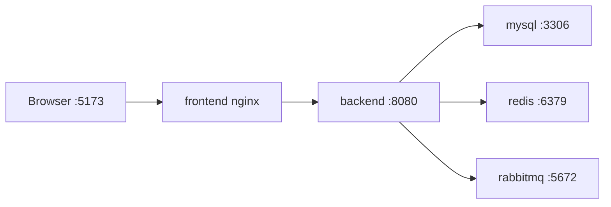

# Milestone 18: CI/CD + Docker 镜像 + 部署基础实施文档

## 1. 背景

当前项目已经完成：

- 后端 Spring Boot 主链路：Auth、Project、Member、Repository、Task、Agent、Chat、RAG、Model Gateway、GitHub PR Review。
- 前端 Vue 3 控制台：登录、项目、任务、Chat SSE、知识库、可观测性、模型网关、GitHub 集成。
- 自动化测试：后端集成测试、前端 Playwright E2E、统一检查脚本。
- 本地基础设施：`deploy/docker-compose.yml` 提供 MySQL、Redis、RabbitMQ。

Milestone 18 的目标是：

> 补齐工程级 CI/CD 与容器化交付基础，让项目可以在 GitHub Actions 中稳定完成构建、测试、镜像构建，并支持本地 Docker Compose 一键启动前后端演示环境。

本阶段不是生产 Kubernetes 上线，不做云厂商绑定，不做复杂蓝绿发布。重点是把“本地可跑、CI 可测、镜像可建、Compose 可演示”的基础闭环打牢。

## 2. 总目标

实现 4 个能力：

1. Docker 镜像
   - 后端可构建 Spring Boot Runtime 镜像。
   - 前端可构建 Nginx 静态资源镜像。
   - 镜像不包含源码缓存、node_modules、target 中间产物。
   - 镜像不内置真实密钥。

2. 本地 Compose 演示环境
   - 一条命令启动 MySQL、Redis、RabbitMQ、backend、frontend。
   - 前端通过容器网络访问后端。
   - 后端通过环境变量连接 MySQL。
   - 支持健康检查与启动顺序。

3. GitHub Actions CI
   - PR / push 时自动跑后端 compile/test/package。
   - 自动跑前端 typecheck/build。
   - 可选跑前端 E2E，要求后端和前端服务可自动启动。
   - 使用 MySQL service container 或 Compose 方式提供数据库。

4. Docker 镜像构建工作流
   - 在 GitHub Actions 中构建 backend/frontend 镜像。
   - 支持 main 分支和 tag 触发。
   - 默认不推送镜像到公网，除非配置 GHCR 权限。
   - 如实现 push，目标为 GitHub Container Registry：`ghcr.io/<owner>/ai-coding-platform-*`。

## 3. 严格约束

执行 Milestone 18 时必须遵守：

1. 不改业务逻辑。
2. 不改 Auth、Project、Task、Chat、RAG、Model Gateway、GitHub PR Review 的接口行为。
3. 不提交真实密钥、真实 API Key、OAuth secret、生产数据库密码。
4. 不写死本机绝对路径。
5. 不引入云厂商强绑定配置。
6. 不引入 Kubernetes、Helm、Terraform。
7. 不重写已有 `deploy/docker-compose.yml`，可以扩展或新增文件。
8. 不把 `frontend/dist`、`backend/target`、`node_modules` 纳入 Git。
9. CI 中不要依赖本机已有服务。
10. 如测试失败，可以修复明确的环境/脚本问题，但必须说明原因和影响范围。

## 4. 需要新增或修改的文件

建议文件清单如下，允许根据实际项目结构微调。

### 4.1 后端 Docker

新增：

```text
backend/Dockerfile
backend/.dockerignore
```

`backend/Dockerfile` 要求：

- 使用多阶段构建。
- build stage 使用 Maven + JDK 17。
- runtime stage 使用 JRE 17 或 Temurin 17。
- 运行用户尽量使用非 root。
- 暴露 `8080`。
- 支持环境变量：
  - `JAVA_OPTS`
  - `SPRING_PROFILES_ACTIVE`
  - `DB_URL`
  - `DB_USERNAME`
  - `DB_PASSWORD`
  - `JWT_SECRET`
  - `MODEL_GATEWAY_PROVIDER`
  - `GITHUB_CLIENT_ID`
  - `GITHUB_CLIENT_SECRET`

示例方向：

```dockerfile
FROM maven:3.9-eclipse-temurin-17 AS build
WORKDIR /app
COPY pom.xml .
RUN mvn -q -DskipTests dependency:go-offline
COPY src ./src
RUN mvn -q -DskipTests package

FROM eclipse-temurin:17-jre
WORKDIR /app
RUN addgroup --system app && adduser --system --ingroup app app
COPY --from=build /app/target/*.jar /app/app.jar
USER app
EXPOSE 8080
ENTRYPOINT ["sh", "-c", "java $JAVA_OPTS -jar /app/app.jar"]
```

注意：实际 Dockerfile 需要根据当前 Maven 插件、JAR 名称和构建结果调整。

`backend/.dockerignore` 至少包含：

```text
target/
.mvn/wrapper/maven-wrapper.jar
.idea/
.vscode/
*.iml
*.log
```

### 4.2 前端 Docker

新增：

```text
frontend/Dockerfile
frontend/.dockerignore
frontend/nginx.conf
```

`frontend/Dockerfile` 要求：

- 使用多阶段构建。
- build stage 使用 Node LTS。
- runtime stage 使用 Nginx alpine。
- 通过 build args 支持 `VITE_API_BASE_URL`。
- Nginx 支持 Vue Router history fallback。
- 静态资源开启合理缓存。
- 不把 `.env` 烘进镜像，除非仅为构建期公开变量。

`frontend/nginx.conf` 要求：

- `try_files $uri $uri/ /index.html;`
- `/api/` 代理到后端容器，例如 `http://backend:8080`。
- SSE 路由需要关闭 buffering：
  - `proxy_buffering off;`
  - `proxy_cache off;`
  - `proxy_read_timeout 3600s;`
- 增加基础安全响应头：
  - `X-Content-Type-Options`
  - `X-Frame-Options`
  - `Referrer-Policy`

`frontend/.dockerignore` 至少包含：

```text
node_modules/
dist/
.idea/
.vscode/
*.log
.env
```

### 4.3 Compose 应用编排

新增：

```text
deploy/docker-compose.app.yml
deploy/README.md
```

`deploy/docker-compose.app.yml` 要求：

- 包含：
  - mysql
  - redis
  - rabbitmq
  - backend
  - frontend
- backend 依赖 mysql healthcheck。
- frontend 依赖 backend healthcheck。
- backend 使用环境变量注入配置。
- frontend 暴露 `5173` 或 `8081` 到宿主机，建议 `5173:80`。
- backend 可选暴露 `8080:8080`，便于调试。
- 使用命名 volume 保存 MySQL 数据。
- 不写真实密钥，使用 `.env` 或 `.env.example`。

推荐命令：

```bash
docker compose -f deploy/docker-compose.app.yml up -d --build
docker compose -f deploy/docker-compose.app.yml logs -f backend
docker compose -f deploy/docker-compose.app.yml down
```

### 4.4 环境变量模板

修改：

```text
.env.example
frontend/.env.example
```

要求：

- `.env.example` 覆盖 Docker Compose 应用启动所需变量。
- 明确哪些是开发默认值，哪些必须在生产替换。
- `JWT_SECRET` 标注必须使用 256-bit 以上强随机值。
- 模型、GitHub OAuth 变量保留为空或示例占位，不提供真实值。
- 前端容器模式推荐使用相对 API：`VITE_API_BASE_URL=/api`。

### 4.5 GitHub Actions

新增：

```text
.github/workflows/backend-ci.yml
.github/workflows/frontend-ci.yml
.github/workflows/docker-build.yml
```

也可以合并为一个 `ci.yml`，但建议分开，便于定位失败阶段。

#### backend-ci.yml

触发：

```yaml
on:
  pull_request:
  push:
    branches: [ main ]
```

要求：

- 使用 `actions/checkout`。
- 设置 JDK 17。
- 缓存 Maven 依赖。
- 启动 MySQL service container。
- 创建数据库和必要用户。
- 设置环境变量：
  - `TEST_DB_URL`
  - `TEST_DB_USERNAME`
  - `TEST_DB_PASSWORD`
  - `JWT_SECRET`
  - `MODEL_GATEWAY_PROVIDER=MOCK`
- 执行：

```bash
cd backend
mvn clean compile
mvn test
mvn package -DskipTests
```

#### frontend-ci.yml

触发同上。

要求：

- 使用 Node LTS，建议 Node 20。
- 使用 `npm ci`，不要在 CI 中使用 `npm install`。
- 缓存 npm。
- 执行：

```bash
cd frontend
npm ci
npm run typecheck
npm run build
```

#### docker-build.yml

触发：

```yaml
on:
  pull_request:
  push:
    branches: [ main ]
    tags: [ "v*" ]
```

要求：

- 构建 backend 镜像。
- 构建 frontend 镜像。
- PR 只 build，不 push。
- main/tag 可选 push 到 GHCR。
- 如 push GHCR，使用：
  - `GITHUB_TOKEN`
  - `packages: write`
  - 镜像名：
    - `ghcr.io/${{ github.repository_owner }}/ai-coding-platform-backend`
    - `ghcr.io/${{ github.repository_owner }}/ai-coding-platform-frontend`
- 镜像 tag：
  - commit SHA
  - branch name
  - semver tag
  - latest 仅 main 分支

### 4.6 发布脚本

新增：

```text
scripts/docker-build-local.sh
scripts/docker-smoke-test.sh
```

`docker-build-local.sh`：

- 构建 backend/frontend 镜像。
- 支持本地 tag，例如 `local`。
- 输出镜像名。

`docker-smoke-test.sh`：

- 启动 `deploy/docker-compose.app.yml`。
- 等待 backend `/actuator/health` 为 `UP`。
- 等待 frontend 首页可访问。
- 可复用 `scripts/backend-unified-smoke-test.sh`。
- 结束时保留服务，或通过参数 `--down` 自动清理。

### 4.7 文档

修改：

```text
README.md
docs/testing-strategy.md
docs/demo-data-guide.md
```

新增：

```text
docs/deployment-guide.md
```

`docs/deployment-guide.md` 内容至少包含：

- 本地 Docker Compose 启动。
- 环境变量说明。
- 镜像构建命令。
- CI 工作流说明。
- GHCR 推送说明。
- 常见问题：
  - MySQL 连接失败
  - Flyway migration failed
  - JWT_SECRET 缺失
  - 前端 502 / API 代理失败
  - SSE 无输出或被 Nginx buffering
  - GitHub OAuth redirect URL 不匹配

## 5. CI 设计要求

### 5.1 后端 CI 数据库策略

CI 不能依赖开发者本机数据库。建议使用 GitHub Actions service container：

```yaml
services:
  mysql:
    image: mysql:8.0
    env:
      MYSQL_ROOT_PASSWORD: platform123
      MYSQL_DATABASE: ai_coding_platform_test
    ports:
      - 3306:3306
    options: >-
      --health-cmd="mysqladmin ping -h 127.0.0.1 -uroot -pplatform123"
      --health-interval=10s
      --health-timeout=5s
      --health-retries=10
```

测试环境变量：

```yaml
TEST_DB_URL: jdbc:mysql://127.0.0.1:3306/ai_coding_platform_test?useUnicode=true&characterEncoding=UTF-8&serverTimezone=Asia/Shanghai&useSSL=false&allowPublicKeyRetrieval=true
TEST_DB_USERNAME: root
TEST_DB_PASSWORD: platform123
JWT_SECRET: ci-test-secret-must-be-at-least-32-bytes
MODEL_GATEWAY_PROVIDER: MOCK
```

如果当前 `application-test.yml` 仍共享开发库，需要在 Milestone 18 中改为 CI 可控测试库，同时确保本地仍可通过环境变量覆盖。

### 5.2 前端 E2E 策略

本阶段前端 CI 默认只要求：

```bash
npm ci
npm run typecheck
npm run build
```

Playwright E2E 可选两种方式：

1. 保持在本地检查脚本中运行。
2. 新增单独 workflow，启动 backend + frontend 后执行。

如果实现 E2E workflow，必须：

- 自动启动后端。
- 自动启动前端。
- 等待服务可用。
- 使用 MOCK 模型。
- 不依赖真实 GitHub OAuth。
- 失败时上传 Playwright traces/screenshots。

### 5.3 缓存策略

Maven：

```yaml
- uses: actions/setup-java@v4
  with:
    distribution: temurin
    java-version: "17"
    cache: maven
```

Node：

```yaml
- uses: actions/setup-node@v4
  with:
    node-version: "20"
    cache: npm
    cache-dependency-path: frontend/package-lock.json
```

### 5.4 安全策略

- CI 日志不得打印密钥。
- Docker build args 只能传公开构建变量。
- 真实模型 API Key、GitHub OAuth Secret 只能通过 GitHub Secrets 注入。
- Docker image 中不能包含 `.env`。
- README 中只能写示例值。

## 6. Docker Compose 应用设计

建议服务拓扑：



### 6.1 端口建议

| 服务 | 容器端口 | 宿主端口 | 说明 |
|---|---:|---:|---|
| frontend | 80 | 5173 | 浏览器访问 |
| backend | 8080 | 8080 | API / Actuator |
| mysql | 3306 | 3307 | 避免与本机 MySQL 冲突 |
| redis | 6379 | 6379 | 当前未强依赖 |
| rabbitmq | 5672 / 15672 | 5672 / 15672 | 当前未强依赖 |

### 6.2 Healthcheck

backend：

```yaml
healthcheck:
  test: ["CMD-SHELL", "wget -qO- http://localhost:8080/actuator/health | grep UP"]
  interval: 10s
  timeout: 5s
  retries: 20
```

frontend：

```yaml
healthcheck:
  test: ["CMD-SHELL", "wget -qO- http://localhost/ >/dev/null"]
  interval: 10s
  timeout: 5s
  retries: 10
```

## 7. 验证要求

完成后必须执行：

### 7.1 本地常规验证

```bash
cd backend
mvn clean compile
mvn test
mvn package -DskipTests

cd ../frontend
npm ci
npm run typecheck
npm run build
```

### 7.2 Docker 构建验证

```bash
docker build -t ai-coding-platform-backend:local ./backend
docker build -t ai-coding-platform-frontend:local ./frontend
```

### 7.3 Compose 启动验证

```bash
docker compose -f deploy/docker-compose.app.yml up -d --build
curl http://localhost:8080/actuator/health
curl -I http://localhost:5173
```

### 7.4 Smoke Test

```bash
scripts/backend-unified-smoke-test.sh
```

如脚本需要环境变量，必须在文档中说明。

### 7.5 GitHub Actions 静态检查

至少确认 workflow YAML 语法正确。可以使用：

```bash
yamllint .github/workflows
```

如果本机没有 `yamllint`，可说明未运行。

## 8. 验收标准

Milestone 18 完成后，必须满足：

- [ ] `backend/Dockerfile` 可构建镜像。
- [ ] `frontend/Dockerfile` 可构建镜像。
- [ ] `deploy/docker-compose.app.yml` 可一键启动前后端和依赖。
- [ ] 前端容器中 Vue Router 刷新不 404。
- [ ] 前端容器访问 `/api/**` 能代理到后端。
- [ ] Chat SSE 在 Nginx 下可持续输出。
- [ ] backend CI workflow 可运行 compile/test/package。
- [ ] frontend CI workflow 可运行 typecheck/build。
- [ ] docker-build workflow 可构建两个镜像。
- [ ] 无真实密钥进入仓库。
- [ ] README / deployment guide 与实际命令一致。
- [ ] 后端测试通过。
- [ ] 前端 typecheck/build 通过。

## 9. 完成报告格式

完成后按以下格式输出：

```markdown
# Milestone 18 完成报告

## 1. 新增/修改文件清单

## 2. Dockerfile 实现说明

## 3. Docker Compose 应用编排说明

## 4. GitHub Actions CI 说明

## 5. 镜像构建与 GHCR 策略

## 6. 环境变量与密钥处理

## 7. 本地验证结果

## 8. Docker/Compose 验证结果

## 9. CI 工作流验证结果

## 10. 修复的问题与原因

## 11. 已知限制

## 12. 是否具备容器化演示与 CI 基础能力
```

## 10. 已知风险与处理建议

| 风险 | 说明 | 建议 |
|---|---|---|
| Flyway 历史失败 | 本地库曾出现 V10 failed migration | 文档中加入 `flyway repair` 排障说明 |
| SSE 被 Nginx 缓冲 | Chat 流式输出依赖 SSE | Nginx `/api/` 或 stream 路由关闭 buffering |
| 前端构建期 API URL | Vite 环境变量是构建期注入 | 容器部署优先用 Nginx `/api` 反向代理 |
| E2E 依赖后端 | Playwright 需要可用 API | CI 可先只跑 build，E2E 单独 workflow |
| GHCR 权限 | 默认 GitHub token 需要 packages write | PR 只 build，main/tag 才 push |

## 11. Claude 执行提示词

可以直接发送以下内容给 Claude：

```text
请根据项目中的文档执行 Milestone 18：CI/CD + Docker 镜像 + 部署基础。

文档路径：
docs/milestone-18-cicd-docker-deployment.md

执行要求：
1. 先完整阅读该文档，再检查当前项目结构、README、scripts、deploy、backend、frontend、.env.example、package-lock、pom.xml。
2. 本阶段是在 Milestone 17 已完成 GitHub OAuth + PR Review 后，补齐容器化和 CI/CD 基础能力。
3. 不改业务逻辑，不改已验证通过的 API 行为。
4. 不接入云厂商，不写 Kubernetes、Helm、Terraform。
5. 不提交真实密钥、真实 API Key、GitHub OAuth Secret、生产数据库密码。
6. 不写死本机绝对路径。
7. 不把 frontend/dist、backend/target、node_modules、.env 纳入 Git。
8. Docker 镜像必须通过环境变量配置运行时参数。
9. 前端容器必须支持 Vue Router history fallback。
10. 前端容器必须能通过 /api 反向代理后端。
11. Chat SSE 在 Nginx 代理下不能被 buffering 破坏。
12. GitHub Actions 中 PR 只 build/test，不 push 镜像。
13. 如实现 GHCR push，只允许 main/tag 触发，并使用 GITHUB_TOKEN 和 packages: write。
14. 可以修复 CI/Docker 暴露出的明确工程问题，但必须说明原因和影响范围。

需要实现：
1. backend/Dockerfile。
2. backend/.dockerignore。
3. frontend/Dockerfile。
4. frontend/.dockerignore。
5. frontend/nginx.conf。
6. deploy/docker-compose.app.yml。
7. deploy/README.md。
8. .github/workflows/backend-ci.yml。
9. .github/workflows/frontend-ci.yml。
10. .github/workflows/docker-build.yml。
11. scripts/docker-build-local.sh。
12. scripts/docker-smoke-test.sh。
13. docs/deployment-guide.md。
14. 更新 README.md，补充 Docker、CI、部署说明。
15. 必要时更新 .env.example / frontend/.env.example，但不要放真实密钥。

完成后必须执行：
后端：
cd backend
mvn clean compile
mvn test
mvn package -DskipTests

前端：
cd frontend
npm ci
npm run typecheck
npm run build

Docker：
docker build -t ai-coding-platform-backend:local ./backend
docker build -t ai-coding-platform-frontend:local ./frontend
docker compose -f deploy/docker-compose.app.yml up -d --build
curl http://localhost:8080/actuator/health
curl -I http://localhost:5173

Smoke：
scripts/backend-unified-smoke-test.sh

完成后按以下格式输出：
1. 新增/修改文件清单
2. Dockerfile 实现说明
3. Docker Compose 应用编排说明
4. GitHub Actions CI 说明
5. 镜像构建与 GHCR 策略
6. 环境变量与密钥处理
7. 本地验证结果
8. Docker/Compose 验证结果
9. CI 工作流验证结果
10. 修复的问题与原因
11. 已知限制
12. 是否具备容器化演示与 CI 基础能力

现在开始执行，不要只给计划。
```
