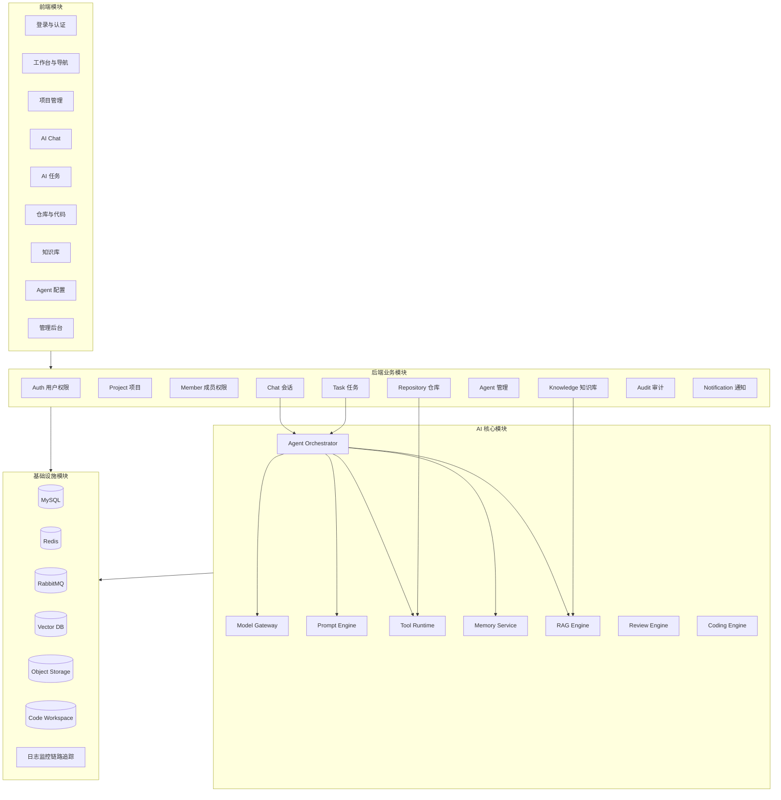

# AI Coding Platform 模块拆分设计

## 1. 拆分目标

本文档用于将 AI Coding Platform 从需求与系统架构进一步拆分为可开发、可测试、可演进的功能模块。

模块拆分目标：

- 明确前端、后端、AI 核心、基础设施的职责边界。
- 明确每个模块的核心能力、输入输出、依赖关系和优先级。
- 支持第一阶段采用模块化单体快速交付，后续平滑演进为微服务。
- 让开发任务可以按模块拆分、排期、验收和并行推进。

## 2. 拆分原则

- 以项目 Project 作为核心业务边界。
- 以任务 Task 作为 AI 自动执行主线。
- 以 Agent 作为 AI 能力承载单元。
- 以 Tool Runtime 作为 AI 操作外部系统的唯一出口。
- 用户、权限、项目、仓库、任务、聊天、知识库、审计等模块保持清晰边界。
- 早期使用模块化单体，模块间通过应用服务接口调用，避免直接跨模块操作数据表。
- 后期可按模块边界拆分为独立服务。

## 3. 总体模块视图



## 4. 后端模块拆分

### 4.1 common 公共模块

模块定位：

- 提供全局基础能力，不承载具体业务。

核心职责：

- 统一响应结构。
- 统一异常处理。
- 分页对象。
- 基础枚举。
- 通用工具类。
- 全局常量。
- Trace ID。
- 时间、JSON、脱敏工具。

主要输出：

- `ApiResponse`。
- `PageRequest`、`PageResult`。
- `BizException`、`ErrorCode`。
- `BaseEntity`。
- 通用枚举和工具。

依赖关系：

- 被所有模块依赖。
- 不依赖任何业务模块。

优先级：

- P0。

### 4.2 security 安全模块

模块定位：

- 提供认证、授权、接口安全和项目级权限校验。

核心职责：

- JWT 认证过滤器。
- 登录用户上下文。
- Spring Security 配置。
- RBAC 权限校验。
- 项目成员权限校验。
- 接口限流扩展点。
- 密码加密。
- Token 黑名单或刷新令牌管理。

主要输入：

- 登录 Token。
- 请求路径。
- 用户角色。
- 项目 ID。

主要输出：

- 当前登录用户。
- 权限校验结果。
- 401/403 错误响应。

依赖关系：

- 依赖 auth 模块读取用户和权限。
- 被所有 Controller 层使用。

优先级：

- P0。

### 4.3 auth 用户认证模块

模块定位：

- 负责用户身份、登录、OAuth、角色与平台权限。

核心职责：

- 用户注册与登录。
- JWT 签发与刷新。
- GitHub OAuth 登录。
- 邮箱验证码登录。
- 用户信息管理。
- 平台角色管理。
- 用户 Token 用量聚合查询。

主要接口：

- `POST /api/auth/login`
- `POST /api/auth/logout`
- `POST /api/auth/refresh`
- `GET /api/auth/me`
- `GET /api/oauth/github/authorize`
- `GET /api/oauth/github/callback`
- `GET /api/users`

核心表：

- `user`
- `role`
- `permission`
- `user_role`
- `github_account`

依赖关系：

- 依赖 common、security、audit。
- 被 project、repository、task、chat 等模块引用用户身份。

优先级：

- P0。

### 4.4 project 项目模块

模块定位：

- 平台核心业务聚合，承载项目配置和协作边界。

核心职责：

- 项目创建、编辑、归档。
- 项目列表与详情。
- 项目技术栈配置。
- 项目模型配置。
- 项目 Agent 配置。
- 项目 Memory/RAG 配置。
- 项目统计概览。

主要接口：

- `POST /api/projects`
- `GET /api/projects`
- `GET /api/projects/{projectId}`
- `PUT /api/projects/{projectId}`
- `DELETE /api/projects/{projectId}`
- `GET /api/projects/{projectId}/overview`
- `PUT /api/projects/{projectId}/config`

核心表：

- `project`
- `project_config`
- `project_agent_config`

依赖关系：

- 依赖 auth 获取 owner。
- 依赖 member 校验项目角色。
- 被 task、chat、repository、knowledge、agent 使用。

优先级：

- P0。

### 4.5 member 项目成员模块

模块定位：

- 负责项目成员、项目角色和项目内权限。

核心职责：

- 邀请成员。
- 移除成员。
- 修改成员角色。
- 查询项目成员。
- 项目角色权限映射。
- 项目资源访问校验。

主要接口：

- `GET /api/projects/{projectId}/members`
- `POST /api/projects/{projectId}/members`
- `PUT /api/projects/{projectId}/members/{userId}/role`
- `DELETE /api/projects/{projectId}/members/{userId}`

核心表：

- `project_member`
- `project_invitation`

依赖关系：

- 依赖 project、auth、audit。
- 被 security、repository、task、chat、knowledge 使用。

优先级：

- P0。

### 4.6 repository 仓库模块

模块定位：

- 负责 GitHub 仓库接入、代码工作区和 Git 操作。

核心职责：

- GitHub OAuth 授权信息读取。
- GitHub 仓库列表。
- 项目绑定仓库。
- Clone 仓库。
- Pull 最新代码。
- Branch 查询与创建。
- Diff 查询。
- Commit、Push、PR 创建。
- Git 操作日志。

主要接口：

- `GET /api/github/repositories`
- `POST /api/projects/{projectId}/repository/bind`
- `POST /api/projects/{projectId}/repository/clone`
- `POST /api/projects/{projectId}/repository/pull`
- `GET /api/projects/{projectId}/repository/branches`
- `GET /api/projects/{projectId}/repository/diff`
- `POST /api/projects/{projectId}/repository/commit`
- `POST /api/projects/{projectId}/repository/push`
- `POST /api/projects/{projectId}/repository/pull-requests`

核心表：

- `project_repository`
- `git_operation_log`
- `repository_branch`

依赖关系：

- 依赖 project、member、auth、audit。
- 调用 Tool Runtime 执行 Git 操作。
- 被 task、review、coding 使用。

优先级：

- P0：仓库绑定、Clone、Branch 查询。
- P1：Commit、Push、PR。

### 4.7 task 任务模块

模块定位：

- AI 自动执行的主线模块。

核心职责：

- 创建 AI 任务。
- 指派 Agent。
- 设置优先级。
- 任务状态流转。
- 投递异步执行消息。
- 任务日志查询。
- 任务产物管理。
- 任务取消、重试。

主要接口：

- `POST /api/projects/{projectId}/tasks`
- `GET /api/projects/{projectId}/tasks`
- `GET /api/tasks/{taskId}`
- `POST /api/tasks/{taskId}/start`
- `POST /api/tasks/{taskId}/cancel`
- `POST /api/tasks/{taskId}/retry`
- `GET /api/tasks/{taskId}/logs`
- `GET /api/tasks/{taskId}/artifacts`

核心表：

- `ai_task`
- `ai_task_log`
- `ai_task_artifact`
- `ai_task_event`

依赖关系：

- 依赖 project、member、agent、audit。
- 通过 RabbitMQ 调用 Agent Orchestrator。
- 被 chat、coding、review 使用。

优先级：

- P0。

### 4.8 chat 会话模块

模块定位：

- 负责项目内 AI 对话、群聊和流式输出。

核心职责：

- 创建会话。
- 保存消息。
- 项目群聊。
- AI Agent 对话。
- WebSocket/SSE 流式输出。
- 消息引用来源。
- 消息上下文关联任务。

主要接口：

- `POST /api/projects/{projectId}/chat/sessions`
- `GET /api/projects/{projectId}/chat/sessions`
- `GET /api/chat/sessions/{sessionId}/messages`
- `POST /api/chat/sessions/{sessionId}/messages`
- `GET /api/chat/sessions/{sessionId}/stream`

核心表：

- `chat_session`
- `chat_message`
- `chat_message_reference`

依赖关系：

- 依赖 project、member、agent、memory。
- 调用 Agent Orchestrator 生成 AI 回复。
- 使用 Redis 管理流式输出和临时状态。

优先级：

- P0。

### 4.9 agent Agent 管理模块

模块定位：

- 负责 Agent 类型、配置、版本和项目启用关系。

核心职责：

- 内置 Agent 管理。
- Agent Prompt 配置。
- Agent 模型配置。
- Agent 工具权限配置。
- Agent 状态管理。
- Agent 版本管理。
- 项目启用 Agent。

主要接口：

- `GET /api/agents`
- `POST /api/agents`
- `GET /api/agents/{agentId}`
- `PUT /api/agents/{agentId}`
- `POST /api/projects/{projectId}/agents/{agentId}/enable`
- `POST /api/projects/{projectId}/agents/{agentId}/disable`

核心表：

- `ai_agent`
- `ai_agent_version`
- `ai_agent_tool_permission`
- `project_agent_config`

依赖关系：

- 依赖 project、auth、audit。
- 被 task、chat、orchestrator 使用。

优先级：

- P0：内置 Agent 查询与项目启用。
- P1：Agent 自定义配置和版本管理。

### 4.10 knowledge 知识库模块

模块定位：

- 负责项目知识库文件管理、解析任务和索引状态。

核心职责：

- 文件上传。
- 文件列表。
- 文件删除。
- 文档解析状态查询。
- 触发向量化。
- 知识库检索入口。
- 知识库来源引用。

主要接口：

- `POST /api/projects/{projectId}/knowledge/documents`
- `GET /api/projects/{projectId}/knowledge/documents`
- `DELETE /api/knowledge/documents/{documentId}`
- `POST /api/knowledge/documents/{documentId}/reindex`
- `POST /api/projects/{projectId}/knowledge/search`

核心表：

- `knowledge_document`
- `knowledge_chunk`
- `knowledge_index_job`

依赖关系：

- 依赖 project、member、audit。
- 调用 RAG Engine 完成解析、Embedding、检索。
- 被 chat、task、coding、review 使用。

优先级：

- P1。

### 4.11 audit 审计模块

模块定位：

- 负责关键操作、AI 调用、工具调用和安全事件审计。

核心职责：

- 记录用户操作。
- 记录项目配置变更。
- 记录 Agent 配置变更。
- 记录模型调用摘要。
- 记录工具调用。
- 记录 Git 写操作。
- 提供审计查询。

主要接口：

- `GET /api/audit/logs`
- `GET /api/projects/{projectId}/audit/logs`

核心表：

- `audit_log`
- `ai_call_log`
- `tool_call_log`

依赖关系：

- 被所有模块调用。
- 不直接依赖业务模块，保存业务对象 ID 和类型。

优先级：

- P0：基础审计写入。
- P1：审计查询与筛选。

### 4.12 notification 通知模块

模块定位：

- 负责任务状态、审批、PR、失败重试等通知。

核心职责：

- 站内通知。
- WebSocket 通知。
- 邮件通知扩展。
- 任务完成通知。
- 任务失败通知。
- 审批待处理通知。

主要接口：

- `GET /api/notifications`
- `POST /api/notifications/{notificationId}/read`

核心表：

- `notification`

依赖关系：

- 被 task、repository、review、audit 使用。
- 依赖 auth 获取用户信息。

优先级：

- P2。

## 5. AI 核心模块拆分

### 5.1 orchestrator Agent 调度模块

模块定位：

- AI 任务执行的核心编排模块。

核心职责：

- 消费任务队列。
- 加载任务、项目、Agent、模型和权限上下文。
- 调用 Context Builder 构建上下文。
- 调用 Prompt Engine 生成 Prompt。
- 调用 Model Gateway。
- 解析模型输出。
- 调用 Tool Runtime。
- 写入执行日志。
- 更新任务状态。

输入：

- `taskId`
- `projectId`
- `agentId`
- `userId`

输出：

- 任务执行日志。
- 任务产物。
- 状态变更事件。

依赖关系：

- 依赖 task、project、agent、memory、rag、model、tool、audit。

优先级：

- P0。

### 5.2 model-gateway 模型网关模块

模块定位：

- 统一管理多模型供应商调用。

核心职责：

- OpenAI、Claude、DeepSeek、Gemini、Qwen 适配。
- Chat Completion。
- Streaming。
- Embedding。
- Tool Calling。
- JSON 结构化输出。
- 模型调用限流。
- 失败重试。
- 成本与 Token 统计。

输入：

- 统一模型请求。
- 模型配置。
- 流式或非流式标记。

输出：

- 统一模型响应。
- Token 用量。
- 错误码。

依赖关系：

- 被 orchestrator、rag、chat 使用。
- 依赖 audit 记录调用日志。

优先级：

- P0：至少接入一个 Chat 模型和一个 Embedding 模型。
- P1：多供应商路由和降级。

### 5.3 prompt-engine Prompt 模块

模块定位：

- 负责 Prompt 模板、变量、版本和安全规则注入。

核心职责：

- Agent 系统 Prompt。
- 任务 Prompt 模板。
- Review Prompt。
- Coding Prompt。
- Prompt 变量渲染。
- 输出格式约束。
- Prompt 版本管理。

输入：

- Agent 类型。
- 任务类型。
- 模板变量。

输出：

- 最终 Prompt。
- 结构化输出 Schema。

依赖关系：

- 被 orchestrator、coding、review 使用。
- 依赖 agent 配置。

优先级：

- P0。

### 5.4 context-builder 上下文构建模块

模块定位：

- 负责为 AI 调用选择、压缩和组装上下文。

核心职责：

- 读取任务需求。
- 注入项目配置。
- 注入 Agent 规则。
- 检索 RAG。
- 获取相关代码文件。
- 读取会话历史。
- 注入 Memory。
- Token 预算裁剪。
- 上下文摘要。

输入：

- `projectId`
- `taskId` 或 `sessionId`
- `agentId`
- 用户问题或任务描述。

输出：

- AI 上下文包。
- 引用来源列表。
- Token 预算信息。

依赖关系：

- 依赖 rag、memory、repository、chat、task。

优先级：

- P0。

### 5.5 tool-runtime 工具运行时模块

模块定位：

- Agent 访问外部能力和执行动作的唯一安全出口。

核心职责：

- 工具注册。
- 工具 Schema。
- 工具权限校验。
- 工具参数校验。
- 工具执行。
- 超时控制。
- 沙箱隔离。
- 工具调用审计。

工具类型：

- 文件读取工具。
- Patch 应用工具。
- 测试运行工具。
- 构建工具。
- Git 工具。
- RAG 检索工具。
- 通知工具。
- DevOps 工具。

依赖关系：

- 被 orchestrator 调用。
- 依赖 repository、audit、workspace。

优先级：

- P0：文件读取、目录扫描、Diff、Patch。
- P1：测试运行、Commit、Push、PR。
- P2：部署工具。

### 5.6 rag-engine RAG 引擎模块

模块定位：

- 负责文档和代码知识库的解析、向量化和检索。

核心职责：

- 文档解析。
- 代码解析。
- Chunk 切分。
- Metadata 生成。
- Embedding。
- 向量写入。
- 混合检索。
- 重排序。
- 来源引用。

输入：

- 文档文件。
- 仓库文件。
- 检索 Query。
- 项目过滤条件。

输出：

- Chunk 索引。
- 检索结果。
- 引用来源。

依赖关系：

- 依赖 knowledge、repository、model-gateway、vector-db、object-storage。
- 被 context-builder、chat、task、review 使用。

优先级：

- P1。

### 5.7 memory-service 记忆模块

模块定位：

- 负责会话记忆、项目记忆和长期决策记忆。

核心职责：

- Session Memory。
- Project Memory。
- Decision Memory。
- 用户偏好。
- Memory 摘要。
- Memory 检索。
- Memory 人工确认。

输入：

- 聊天消息。
- 任务总结。
- AI 决策。
- 用户确认内容。

输出：

- 可注入上下文的 Memory。
- 项目知识沉淀。

依赖关系：

- 依赖 chat、task、project、vector-db、mysql。
- 被 context-builder 使用。

优先级：

- P1。

### 5.8 coding-engine AI Coding 模块

模块定位：

- 负责代码生成、代码修改、测试生成和文档生成的领域逻辑。

核心职责：

- 识别任务类型。
- 生成代码修改计划。
- 生成 Patch。
- 生成 Controller、Service、Mapper、Vue 页面、SQL。
- 生成单元测试。
- 生成文档。
- 运行测试并修复失败。

输入：

- 任务描述。
- 项目上下文。
- 相关代码。
- 技术栈配置。

输出：

- 代码 Patch。
- 新增文件。
- 测试报告。
- 文档产物。

依赖关系：

- 依赖 orchestrator、prompt-engine、tool-runtime、repository、rag。

优先级：

- P1。

### 5.9 review-engine AI Review 模块

模块定位：

- 负责代码质量、安全、性能和规范审查。

核心职责：

- 分析 Diff。
- 识别潜在 Bug。
- 安全漏洞检查。
- 性能风险检查。
- 代码规范检查。
- 生成 Review 报告。
- 生成修复建议。

输入：

- PR Diff。
- 任务 Patch。
- 相关代码上下文。
- 项目规范。

输出：

- Review 报告。
- 问题列表。
- 风险等级。
- 修复建议。

依赖关系：

- 依赖 repository、rag、prompt-engine、model-gateway。
- 被 repository、task 使用。

优先级：

- P2。

## 6. 前端模块拆分

### 6.1 app-shell 应用壳模块

职责：

- 登录态初始化。
- 全局布局。
- 顶部导航。
- 侧边菜单。
- 路由守卫。
- 权限菜单。
- 全局错误页。

优先级：

- P0。

### 6.2 auth-view 登录模块

职责：

- 账号密码登录。
- GitHub OAuth 登录入口。
- 邮箱验证码登录。
- 登录状态维护。
- 用户信息展示。

页面：

- `/login`
- `/oauth/callback/github`

优先级：

- P0。

### 6.3 dashboard 工作台模块

职责：

- 我的项目。
- 最近任务。
- Token 用量概览。
- 待处理审批。
- 最近 AI 活动。

页面：

- `/dashboard`

优先级：

- P0。

### 6.4 project 项目模块

职责：

- 项目列表。
- 创建项目。
- 项目详情。
- 项目概览。
- 项目设置。
- 成员管理。

页面：

- `/projects`
- `/projects/:projectId`
- `/projects/:projectId/settings`
- `/projects/:projectId/members`

优先级：

- P0。

### 6.5 chat AI Chat 模块

职责：

- 会话列表。
- 消息流。
- AI 流式输出。
- Agent 选择。
- 引用文件。
- Markdown 渲染。
- 代码高亮。
- 输出中断和重试。

页面：

- `/projects/:projectId/chat`

核心组件：

- `ChatSessionList`
- `ChatMessageList`
- `ChatComposer`
- `AgentSelector`
- `MessageMarkdown`
- `ReferencePanel`

优先级：

- P0。

### 6.6 task AI 任务模块

职责：

- 任务列表。
- 创建任务。
- 任务详情。
- 任务状态流转展示。
- 执行日志。
- 任务产物。
- Diff 查看。
- 重试和取消。

页面：

- `/projects/:projectId/tasks`
- `/projects/:projectId/tasks/:taskId`

核心组件：

- `TaskTable`
- `TaskCreateDialog`
- `TaskStatusTimeline`
- `TaskLogViewer`
- `TaskArtifactPanel`
- `CodeDiffViewer`

优先级：

- P0。

### 6.7 repository 仓库模块

职责：

- GitHub 仓库绑定。
- 分支列表。
- Clone/Pull 状态。
- 文件树。
- Diff 查看。
- Commit/Push/PR 操作确认。

页面：

- `/projects/:projectId/repository`
- `/projects/:projectId/repository/diff`

优先级：

- P0：绑定、分支、Clone 状态。
- P1：Commit、Push、PR。

### 6.8 knowledge 知识库模块

职责：

- 文档上传。
- 文档列表。
- 解析状态。
- 重新索引。
- 知识库检索。
- 引用来源查看。

页面：

- `/projects/:projectId/knowledge`

优先级：

- P1。

### 6.9 agent Agent 配置模块

职责：

- Agent 列表。
- Agent 详情。
- 项目启用 Agent。
- Prompt 配置。
- 模型配置。
- 工具权限配置。

页面：

- `/projects/:projectId/agents`
- `/admin/agents`

优先级：

- P0：项目启用内置 Agent。
- P1：自定义 Agent 配置。

### 6.10 admin 管理后台模块

职责：

- 用户管理。
- 模型配置。
- Agent 管理。
- Token 用量。
- 审计日志。
- 系统监控。

页面：

- `/admin/users`
- `/admin/models`
- `/admin/agents`
- `/admin/usage`
- `/admin/audit`
- `/admin/monitor`

优先级：

- P1。

## 7. 基础设施模块拆分

### 7.1 database 数据库模块

职责：

- MySQL 表结构。
- Flyway/Liquibase 迁移。
- 初始化角色权限。
- 初始化内置 Agent。
- 索引设计。

优先级：

- P0。

### 7.2 cache 缓存模块

职责：

- Redis Key 规范。
- Session 缓存。
- 验证码缓存。
- 限流计数。
- 流式输出临时缓存。
- 短期 Memory。

优先级：

- P0。

### 7.3 message-queue 消息队列模块

职责：

- AI 任务队列。
- RAG 解析队列。
- Git 操作队列。
- Review 队列。
- 死信队列。
- 重试策略。

优先级：

- P0。

### 7.4 workspace 代码工作区模块

职责：

- 项目仓库存储目录。
- 任务临时目录。
- 分支隔离。
- Patch 应用。
- 构建和测试执行目录。
- 工作区清理。

优先级：

- P0。

### 7.5 object-storage 对象存储模块

职责：

- 上传文档。
- 任务附件。
- Review 报告。
- 测试报告。
- 大文件产物。

优先级：

- P1。

### 7.6 observability 可观测模块

职责：

- 应用日志。
- AI 调用日志。
- Trace ID。
- 指标采集。
- 告警。
- Token 和成本统计。

优先级：

- P1。

## 8. 建议代码目录结构

### 8.1 后端目录结构

```text
backend/
  src/main/java/com/aicoding/platform/
    AICodingPlatformApplication.java
    common/
      config/
      exception/
      response/
      pagination/
      util/
    security/
      config/
      filter/
      context/
      permission/
    auth/
      controller/
      application/
      domain/
      infrastructure/
      dto/
    project/
      controller/
      application/
      domain/
      infrastructure/
      dto/
    member/
      controller/
      application/
      domain/
      infrastructure/
      dto/
    repository/
      controller/
      application/
      domain/
      infrastructure/
      dto/
    task/
      controller/
      application/
      domain/
      infrastructure/
      dto/
    chat/
      controller/
      application/
      domain/
      infrastructure/
      dto/
    agent/
      controller/
      application/
      domain/
      infrastructure/
      dto/
    knowledge/
      controller/
      application/
      domain/
      infrastructure/
      dto/
    ai/
      orchestrator/
      model/
      prompt/
      context/
      tool/
      rag/
      memory/
      coding/
      review/
    audit/
      controller/
      application/
      domain/
      infrastructure/
      dto/
    notification/
      controller/
      application/
      domain/
      infrastructure/
      dto/
  src/main/resources/
    application.yml
    mapper/
    db/migration/
```

### 8.2 前端目录结构

```text
frontend/
  src/
    app/
      router/
      store/
      layouts/
      guards/
    shared/
      api/
      components/
      composables/
      constants/
      types/
      utils/
    modules/
      auth/
      dashboard/
      project/
      member/
      repository/
      task/
      chat/
      agent/
      knowledge/
      admin/
    styles/
    main.ts
```

## 9. 模块依赖规则

### 9.1 后端依赖规则

- controller 只能调用 application service。
- application service 编排业务流程，可以调用其他模块公开的 application facade。
- domain 不依赖 controller、infrastructure 和其他模块实现。
- infrastructure 负责数据库、外部 API、消息队列、对象存储等适配。
- 模块之间禁止直接访问彼此 Mapper。
- AI 模块不能绕过 Tool Runtime 操作 Git、文件系统和外部 API。

### 9.2 前端依赖规则

- modules 内部组件优先自包含。
- shared 只放通用能力，不放业务流程。
- 页面组件负责组合，不直接写复杂请求逻辑。
- API 请求统一放在模块的 api 文件中。
- Pinia Store 只保存跨页面状态，不替代服务层。

## 10. 模块优先级与里程碑

### 10.1 P0 第一阶段必须完成

| 模块 | 交付能力 |
| --- | --- |
| common | 统一响应、异常、分页 |
| security | JWT、权限、项目访问控制 |
| auth | 登录、当前用户、GitHub OAuth 基础 |
| project | 项目创建、列表、详情、配置 |
| member | 项目成员和角色 |
| repository | GitHub 仓库绑定、Clone、分支查询 |
| agent | 内置 Agent 和项目启用 |
| task | 任务创建、状态、日志、产物 |
| chat | 项目 AI Chat 和流式输出 |
| orchestrator | 单 Agent 任务执行 |
| model-gateway | 至少一个 Chat 模型接入 |
| prompt-engine | 基础 Prompt 模板 |
| context-builder | 项目、任务、会话上下文组装 |
| tool-runtime | 文件读取、目录扫描、Diff、Patch |
| database/cache/mq/workspace | 基础设施闭环 |

### 10.2 P1 第二阶段增强

| 模块 | 交付能力 |
| --- | --- |
| knowledge | 文档上传、解析、索引 |
| rag-engine | Embedding、向量检索、混合检索 |
| memory-service | 会话记忆、项目记忆 |
| coding-engine | 代码生成、Patch、测试生成 |
| repository | Commit、Push、PR |
| admin | 用户、模型、Agent 管理 |
| observability | AI 调用日志、Token 统计 |

### 10.3 P2 第三阶段高级能力

| 模块 | 交付能力 |
| --- | --- |
| review-engine | AI PR Review |
| notification | 站内通知、审批提醒 |
| devops tools | 构建部署、环境诊断 |
| multi-agent workflow | 多 Agent 协作、链式任务 |
| plugin/mcp | 插件与 MCP 扩展 |
| cost-center | 成本中心、预算和限额 |

## 11. MVP 开发切片建议

### 11.1 垂直切片一：登录与项目

目标：

- 用户能登录并创建项目。

包含模块：

- common。
- security。
- auth。
- project。
- member。
- 前端 auth、dashboard、project。

验收：

- 登录成功后进入工作台。
- 用户可以创建项目。
- 项目成员权限生效。

### 11.2 垂直切片二：仓库接入

目标：

- 项目可以绑定 GitHub 仓库并完成 Clone。

包含模块：

- repository。
- workspace。
- audit。
- 前端 repository。

验收：

- 用户可以查看 GitHub 仓库列表。
- 项目可以绑定仓库。
- 服务端可以 Clone 仓库并读取分支。

### 11.3 垂直切片三：AI Chat

目标：

- 用户可以在项目内与 AI 流式对话。

包含模块：

- chat。
- agent。
- model-gateway。
- prompt-engine。
- context-builder。
- 前端 chat。

验收：

- 用户发送消息后收到流式 AI 回复。
- 聊天记录保存。
- AI 回复关联 Agent 和模型调用日志。

### 11.4 垂直切片四：AI 任务执行

目标：

- 用户可以创建任务并由 Agent 执行。

包含模块：

- task。
- orchestrator。
- tool-runtime。
- workspace。
- audit。
- 前端 task。

验收：

- 任务可创建、执行、失败、重试。
- 执行日志实时输出。
- Agent 可以读取项目代码并生成结果。

### 11.5 垂直切片五：RAG 与代码生成

目标：

- AI 可以结合知识库和代码上下文生成 Patch。

包含模块：

- knowledge。
- rag-engine。
- memory-service。
- coding-engine。
- repository Diff。

验收：

- 文档可上传并索引。
- AI 任务可检索知识库。
- AI 生成 Patch 并展示 Diff。

## 12. 拆分后的服务演进

第一阶段模块化单体：

```text
backend-app
  common
  security
  auth
  project
  member
  repository
  task
  chat
  agent
  knowledge
  ai
  audit
  notification
```

第二阶段独立 Worker：

```text
backend-api
ai-worker
rag-worker
git-worker
```

第三阶段微服务：

```text
gateway-service
auth-service
project-service
repository-service
task-service
chat-service
agent-service
ai-service
rag-service
audit-service
notification-service
```

## 13. 总结

模块拆分建议以 P0 垂直闭环为优先：登录、项目、成员、仓库、Agent、Chat、Task、单 Agent 执行和基础工具运行时。完成闭环后，再扩展 RAG、Memory、Coding、Review、通知、成本和 DevOps 能力。这样的拆分既能快速启动开发，又能保留后续微服务化和企业级治理的演进空间。

