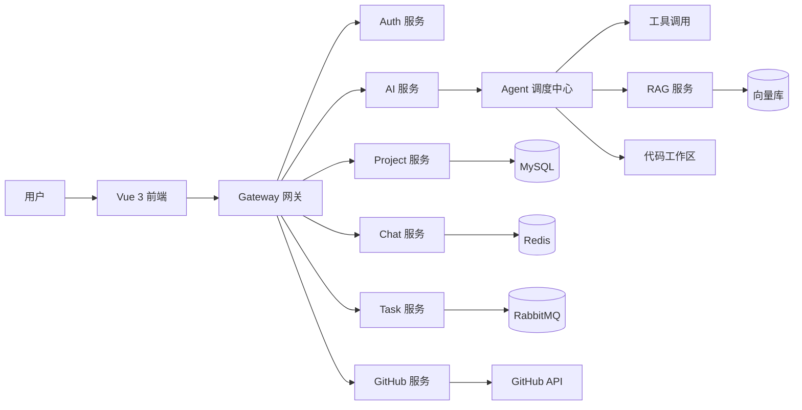

# AI Coding Platform 需求分析文档

## 1. 文档信息

| 项目 | 内容 |
| --- | --- |
| 产品名称 | AI Coding Platform（AI 编码协作平台） |
| 产品定位 | 面向团队协作的企业级 AI Coding 平台 |
| 目标用户 | 软件研发团队、平台管理员、项目负责人、开发成员 |
| 文档类型 | 产品需求分析文档 |
| 当前版本 | v1.0 |

## 2. 项目背景

随着 AI Coding（AI 辅助编程）快速发展，传统研发流程正在从“人独立编写代码”转向“人与 AI Agent 协同完成研发任务”。现有 AI 编程工具已经具备较强的代码生成、补全和问答能力，但在团队协作、项目上下文共享、企业权限管控、工作流编排和代码质量治理方面仍存在明显不足。

当前工具常见问题包括：

- 缺乏团队级协同能力，AI 输出与团队任务、项目成员、代码流程之间连接较弱。
- 缺少统一的 AI Agent 管理与调度中心，难以沉淀组织级 AI 开发能力。
- 缺少项目级上下文记忆，无法长期理解代码结构、历史决策与业务约束。
- 缺少任务拆解、自动执行、失败重试和审批机制。
- 缺少完整的 AI Code Review、质量控制、安全检查和审计能力。
- 缺少企业级 GitHub、RAG、DevOps、权限、监控和插件扩展能力。

因此，本项目需要构建一个面向团队协作的 AI Coding 平台，帮助研发团队实现多 Agent 协同开发、项目知识沉淀、自动代码生成、自动代码审查、GitHub 仓库接入、实时 AI 对话协作和 AI DevOps 自动化。

## 3. 产品目标

### 3.1 核心目标

1. 构建企业级 AI Coding 团队协作平台，支持项目、成员、任务、Agent、代码仓库和知识库统一管理。
2. 支持多个 AI Agent 协同完成研发任务，包括架构设计、后端开发、前端开发、测试生成、代码审核和部署运维。
3. 建立项目级上下文记忆，自动读取项目代码、构建代码知识库、保存开发历史和 AI 决策过程。
4. 支持 AI 自动编码，包括接口生成、数据库设计、前端页面生成、测试生成、文档生成和 Bug 修复。
5. 集成 GitHub，实现 OAuth 登录、仓库导入、自动 Clone/Pull/Commit/Push/PR 和 AI PR Review。
6. 提供实时 AI 协作体验，支持项目群聊、AI 群聊、SSE/WebSocket 流式输出、Markdown 渲染和代码高亮。

### 3.2 成功指标

| 指标类型 | 指标 |
| --- | --- |
| 用户协作 | 支持项目成员邀请、角色分配、任务协作和 AI 工作日志查看 |
| AI 执行 | 支持任务创建后由指定 Agent 自动执行，并记录执行状态、日志和产物 |
| 代码能力 | 支持至少后端接口、Vue 页面、SQL、单元测试和文档生成 |
| 仓库集成 | 支持 GitHub OAuth、仓库导入、分支读取、代码拉取、提交和 PR 创建 |
| 知识库 | 支持上传文档和代码文件，完成切分、向量化、检索和问答增强 |
| 性能 | 支持 1000+ 在线用户，AI 输出具备低延迟流式体验 |
| 安全 | 支持 JWT、RBAC、项目级权限、Agent 权限隔离和敏感操作审计 |

## 4. 用户角色与权限

### 4.1 平台管理员 Admin

平台管理员负责系统级配置和治理。

核心权限：

- 用户管理：查看、禁用、启用用户。
- Agent 管理：创建、启用、停用和配置系统内置 Agent。
- 模型配置：管理 OpenAI、Claude、DeepSeek、Gemini、Qwen 等模型供应商配置。
- Token 管理：查看用户与项目级 Token 消耗。
- 系统监控：查看任务执行、AI 调用、WebSocket、队列和错误日志。
- 调度配置：配置 AI 任务并发数、超时时间、重试策略和限流规则。

### 4.2 项目负责人 Project Owner

项目负责人负责单个项目的配置、成员和交付进度。

核心权限：

- 创建、编辑、归档项目。
- 邀请或移除项目成员。
- 设置成员项目角色。
- 配置项目 Agent、模型、Memory 和 RAG。
- 查看项目开发进度、AI 任务状态和执行日志。
- 管理项目知识库和仓库配置。

### 4.3 开发成员 Developer

开发成员负责日常研发协作和 AI 编码使用。

核心权限：

- 查看参与项目。
- 创建和编辑任务。
- 与 AI Agent 进行单聊或项目群聊。
- 查看 AI 输出、代码变更和任务日志。
- 发起代码生成、Bug 修复、测试生成和文档生成。
- 在授权范围内提交代码或创建 PR。

### 4.4 AI Agent

AI Agent 是平台内的自动执行主体。

核心职责：

- 分析需求、代码和上下文。
- 执行指定 Prompt 和工具调用。
- 读取、修改和生成代码。
- 生成测试、文档和 Review 报告。
- 输出执行日志、状态和结果。
- 使用项目 Memory 和 RAG 检索上下文。

## 5. 产品范围

### 5.1 MVP 范围

第一版应优先交付可闭环的“项目 + 仓库 + AI Chat + 任务 + Agent 执行”能力。

MVP 必须包含：

- 用户登录：JWT 登录、基础用户信息。
- 权限：系统角色、项目角色、接口权限校验。
- 项目管理：项目创建、项目列表、项目详情、项目成员管理。
- GitHub 集成：OAuth 授权、仓库导入、仓库 Clone、分支读取。
- AI Chat：项目内 AI 对话、流式输出、Markdown 渲染、代码高亮。
- Agent 管理：内置 Agent 类型、Agent 配置、Agent 状态。
- 任务系统：创建任务、指派 Agent、状态流转、执行日志。
- 基础 AI Coding：基于任务生成代码或修改建议。
- 基础知识库：代码文件索引、文档上传、向量检索。

### 5.2 后续增强范围

- 多 Agent 自动协同工作流。
- 自动 Commit、Push、PR 创建。
- AI PR Review。
- AI 自动部署与 DevOps 工作流。
- MCP 插件系统。
- 企业级监控、审计、用量分析和成本控制。
- 更完整的长期 Memory 和决策记录系统。

### 5.3 非目标

当前阶段不优先建设以下能力：

- 替代完整 IDE 的本地编辑体验。
- 自研大模型训练平台。
- 完整 CI/CD 平台替代品。
- 多代码托管平台同时深度集成。
- 面向非技术人员的低代码应用生成平台。

## 6. 业务需求

## 6.1 用户系统

### 功能需求

用户系统负责身份认证、用户信息、权限和用量基础数据。

支持登录方式：

- JWT 账号密码登录。
- GitHub OAuth 登录。
- 邮箱验证码登录。

用户信息包括：

- 用户 ID。
- 用户名。
- 邮箱。
- 头像。
- GitHub 账号信息。
- Token 使用量。
- 平台角色。
- 创建时间、更新时间、最后登录时间。

权限控制要求：

- 基于 Spring Security 实现认证和授权。
- 采用 RBAC 权限模型。
- 支持菜单权限、接口权限和项目权限。
- 支持 Admin、Project Owner、Developer 等角色。

### 验收标准

- 用户可以通过账号密码登录并获得 JWT。
- 未登录用户访问受保护接口时返回 401。
- 无权限用户访问项目资源时返回 403。
- 用户可以绑定 GitHub 账号。
- 管理员可以查看用户列表和用户基础用量。

## 6.2 项目管理模块

### 功能需求

项目管理模块用于承载团队协作和项目上下文。

项目创建支持：

- 项目名称。
- 项目描述。
- 技术栈。
- 仓库地址。
- 项目图标。
- 项目负责人。

项目成员管理支持：

- 邀请成员。
- 移除成员。
- 设置项目角色。
- 查询项目成员列表。
- 基于项目角色控制项目内操作权限。

项目配置支持：

- 默认模型配置。
- Agent 配置。
- Memory 配置。
- RAG 配置。
- GitHub 仓库配置。

### 验收标准

- Project Owner 可以创建项目。
- 项目成员只能访问自己加入的项目。
- Project Owner 可以邀请成员并分配角色。
- 项目配置变更应记录操作人和操作时间。

## 6.3 GitHub 仓库模块

### 功能需求

GitHub 仓库模块负责代码托管平台接入和 AI Git 操作。

GitHub 集成支持：

- GitHub OAuth 授权。
- 获取用户可访问 Repository。
- 导入 Repository 到项目。
- Clone 仓库到服务端工作区。
- Branch 管理。
- Pull 最新代码。

AI Git 操作支持：

- 根据 AI 代码变更自动生成 Commit Message。
- 自动 Commit。
- 自动 Push 到指定分支。
- 自动生成 Pull Request。
- 记录每次 Git 操作日志。

PR Review 支持：

- AI 自动审查代码。
- 安全漏洞分析。
- 代码规范检查。
- 性能问题分析。
- 输出 Review 结论、风险等级和修改建议。

### 验收标准

- 用户完成 GitHub OAuth 后可以看到授权仓库列表。
- 项目可以绑定一个 GitHub 仓库。
- 系统可以 Clone 指定仓库和读取分支列表。
- AI 生成的代码变更可以被记录为任务产物。
- 创建 PR 前必须进行权限校验和操作确认。

## 6.4 AI Agent 模块

### 功能需求

平台内置以下 Agent 类型：

| Agent | 职责 |
| --- | --- |
| Architect Agent | 需求分析、技术方案、系统设计、模块拆解 |
| Backend Agent | 后端接口、服务、数据库、业务逻辑实现 |
| Frontend Agent | Vue 页面、组件、状态管理、前端交互实现 |
| Test Agent | 单元测试、接口测试、Mock 数据、测试计划 |
| Review Agent | Code Review、安全检查、性能分析、规范检查 |
| DevOps Agent | 构建部署、CI/CD、环境配置、运行诊断 |

Agent 能力要求：

- 读取项目代码。
- 调用模型执行 Prompt。
- 调用工具执行文件读取、代码修改、测试运行、Git 操作。
- 使用项目 Memory 和 RAG。
- 输出流式日志。
- 保存执行结果。
- 支持启用、停用、配置和版本管理。

Agent 工作流要求：

- 支持单 Agent 执行任务。
- 支持多 Agent 链式调用。
- 支持任务失败自动重试。
- 支持人工审批后继续执行。
- 支持任务超时和取消。

### 验收标准

- 管理员可以创建和配置 Agent。
- 项目负责人可以为项目启用指定 Agent。
- 用户创建任务时可以选择 Agent。
- Agent 执行过程必须保存日志、状态和最终结果。
- Agent 调用敏感工具前必须进行权限校验。

## 6.5 AI Chat 模块

### 功能需求

AI Chat 模块负责实时协作、AI 问答和上下文交互。

聊天类型支持：

- 单人聊天。
- 项目群聊。
- AI 群聊。
- 多 Agent 同时输出。

流式输出支持：

- SSE。
- WebSocket。
- 实时 Token 输出。
- Markdown 渲染。
- 代码高亮。
- 输出中断和重试。

上下文记忆支持：

- Session Memory。
- Redis Memory。
- 长期 Memory。
- Token 截断。
- 项目上下文注入。

### 验收标准

- 用户可以在项目中发起 AI 对话。
- AI 回复以流式方式展示。
- Markdown 和代码块能够正确渲染。
- 聊天记录保存到数据库。
- 同一项目内有权限成员可以查看项目群聊记录。

## 6.6 RAG 知识库模块

### 功能需求

RAG 知识库模块负责项目文档、代码和历史信息检索增强。

文档上传支持：

- PDF。
- Word。
- Markdown。
- 代码文件。

向量化处理支持：

- Embedding。
- Chunk 切分。
- Metadata 存储。
- 文档解析状态记录。
- 失败重试。

检索增强支持：

- 向量检索。
- 代码检索。
- 混合检索。
- 重排序。
- 检索结果引用来源展示。

### 验收标准

- 用户可以上传知识库文件。
- 系统可以解析文件并生成向量索引。
- AI Chat 和 Agent 执行任务时可以检索项目知识库。
- 检索结果需要包含来源、片段和相似度信息。

## 6.7 AI Coding 模块

### 功能需求

AI Coding 模块负责代码生成、代码修改、测试生成和文档生成。

AI 代码生成支持：

- Controller 生成。
- Service 生成。
- Mapper 生成。
- Vue 页面生成。
- SQL 生成。
- API 文档生成。

AI 代码修改支持：

- Bug 修复。
- 重构优化。
- 代码补全。
- 注释生成。
- 代码风格统一。

AI 测试支持：

- 单元测试生成。
- 接口测试生成。
- Mock 数据生成。
- 测试用例建议。

### 验收标准

- 用户可以基于自然语言需求创建代码生成任务。
- 系统能够根据项目代码上下文生成变更建议或代码文件。
- 生成结果必须关联任务、Agent、项目和代码仓库。
- 高风险修改需要人工确认后才能提交到仓库。

## 6.8 任务系统

### 功能需求

任务系统负责 AI 任务创建、分配、执行、状态流转和通知。

任务创建支持：

- 任务标题。
- 任务描述。
- 所属项目。
- 指派 Agent。
- 优先级。
- 截止时间。
- 附件或关联文档。

任务状态包括：

- 待处理。
- 执行中。
- Review 中。
- 已完成。
- 已失败。
- 已取消。

AI 自动执行支持：

- 手动触发。
- 定时任务。
- 失败重试。
- 消息通知。
- 执行日志。
- 执行产物。

### 验收标准

- 用户可以创建任务并指派 Agent。
- 任务状态应随执行过程自动变更。
- 任务失败时必须记录失败原因。
- 用户可以查看任务执行日志和输出产物。
- Project Owner 可以取消或重新执行任务。

## 7. 非功能需求

### 7.1 性能需求

- 支持 1000+ 在线用户。
- AI 流式输出应具备低延迟体验。
- WebSocket 支持高并发连接。
- Agent 执行、RAG 解析、Git 操作和模型调用应采用异步任务。
- 支持任务队列削峰，避免模型调用和代码仓库操作阻塞主链路。

### 7.2 缓存需求

使用 Redis 缓存：

- 用户 Session。
- JWT 黑名单或刷新 Token。
- RAG 查询结果。
- AI 输出片段。
- 验证码。
- 限流计数。

### 7.3 安全需求

系统安全要求：

- JWT 鉴权。
- RBAC 权限控制。
- 项目级资源隔离。
- 接口限流。
- SQL 注入防御。
- XSS 防御。
- 敏感配置加密存储。
- 关键操作审计日志。

AI 安全要求：

- Prompt 注入防御。
- 敏感词过滤。
- Token 限制。
- Agent 权限隔离。
- 工具调用白名单。
- Git 写操作审批。
- 防止 AI 读取未授权项目数据。

### 7.4 可扩展性需求

平台应支持：

- 新 Agent 类型扩展。
- 新模型供应商接入。
- 新工具接入。
- MCP 协议扩展。
- 插件系统。
- 多租户演进。
- 不同项目级模型和 Agent 配置。

### 7.5 可观测性需求

系统需要记录：

- AI 调用耗时、Token 消耗、模型名称和错误信息。
- Agent 执行状态、任务队列状态和重试次数。
- WebSocket 连接数、消息量和失败率。
- RAG 索引状态、检索耗时和命中情况。
- Git 操作日志和 PR Review 结果。

## 8. 技术方案

### 8.1 后端技术栈

- Java 17。
- Spring Boot 3.x。
- Spring Security。
- MyBatis-Plus。
- MySQL 8。
- Redis。
- RabbitMQ。
- WebSocket。
- LangChain4j。
- Spring AI。

### 8.2 前端技术栈

- Vue 3。
- TypeScript。
- Vite。
- Pinia。
- Element Plus。
- Monaco Editor。
- Markdown Renderer。

### 8.3 AI 技术栈

模型供应商支持：

- OpenAI。
- Claude。
- DeepSeek。
- Gemini。
- Qwen。

AI 框架与协议：

- LangChain4j。
- Spring AI。
- MCP Protocol。
- Tool Calling。
- Embedding。
- RAG。

## 9. 系统架构设计

系统采用“微服务 + AI Agent 调度中心 + RAG 知识库 + GitHub 集成”的架构。

### 9.1 服务划分

| 服务 | 职责 |
| --- | --- |
| Gateway 网关 | 统一入口、鉴权转发、限流、跨域处理 |
| Auth 服务 | 登录、OAuth、JWT、用户、角色和权限 |
| Project 服务 | 项目、成员、项目配置、项目权限 |
| GitHub 服务 | GitHub OAuth、仓库导入、Clone、Branch、Commit、PR |
| AI 服务 | 模型适配、Agent 调度、Prompt Engine、Tool Calling |
| RAG 服务 | 文档解析、向量化、检索、重排序 |
| Chat 服务 | 聊天会话、消息存储、SSE/WebSocket 输出 |
| Task 服务 | 任务创建、状态流转、异步执行、通知和日志 |
| Monitor 服务 | 调用监控、Token 用量、任务监控、审计日志 |

### 9.2 架构关系

### 9.3 架构特点

- 高并发：使用 Redis、RabbitMQ、WebSocket 和异步任务处理提升吞吐。
- AI 解耦：通过 Agent 调度中心、Prompt Engine 和 Tool Calling 解耦模型与业务。
- 可扩展：支持插件化 Agent、模型热切换、MCP 工具扩展和项目级配置。
- 可治理：通过审计日志、Token 统计、权限隔离和任务日志确保企业可控。

## 10. 数据库核心设计

### 10.1 user 用户表

| 字段 | 类型建议 | 说明 |
| --- | --- | --- |
| id | BIGINT | 主键 |
| username | VARCHAR(64) | 用户名 |
| email | VARCHAR(128) | 邮箱 |
| password | VARCHAR(255) | 加密密码 |
| avatar | VARCHAR(512) | 头像地址 |
| github_id | VARCHAR(64) | GitHub 用户 ID |
| role | VARCHAR(32) | 平台角色 |
| token_usage | BIGINT | Token 使用量 |
| create_time | DATETIME | 创建时间 |
| update_time | DATETIME | 更新时间 |

### 10.2 project 项目表

| 字段 | 类型建议 | 说明 |
| --- | --- | --- |
| id | BIGINT | 主键 |
| name | VARCHAR(128) | 项目名称 |
| description | TEXT | 项目描述 |
| repo_url | VARCHAR(512) | 仓库地址 |
| owner_id | BIGINT | 项目负责人 ID |
| tech_stack | VARCHAR(512) | 技术栈 |
| icon | VARCHAR(512) | 项目图标 |
| create_time | DATETIME | 创建时间 |
| update_time | DATETIME | 更新时间 |

### 10.3 project_member 项目成员表

| 字段 | 类型建议 | 说明 |
| --- | --- | --- |
| id | BIGINT | 主键 |
| project_id | BIGINT | 项目 ID |
| user_id | BIGINT | 用户 ID |
| role | VARCHAR(32) | 项目角色 |
| create_time | DATETIME | 加入时间 |

### 10.4 ai_agent AI Agent 表

| 字段 | 类型建议 | 说明 |
| --- | --- | --- |
| id | BIGINT | 主键 |
| name | VARCHAR(128) | Agent 名称 |
| type | VARCHAR(64) | Agent 类型 |
| model_name | VARCHAR(128) | 模型名称 |
| prompt | TEXT | 系统 Prompt |
| status | VARCHAR(32) | 状态 |
| create_time | DATETIME | 创建时间 |
| update_time | DATETIME | 更新时间 |

### 10.5 ai_task AI 任务表

| 字段 | 类型建议 | 说明 |
| --- | --- | --- |
| id | BIGINT | 主键 |
| title | VARCHAR(255) | 任务标题 |
| description | TEXT | 任务描述 |
| project_id | BIGINT | 项目 ID |
| agent_id | BIGINT | Agent ID |
| status | VARCHAR(32) | 任务状态 |
| priority | VARCHAR(32) | 优先级 |
| create_time | DATETIME | 创建时间 |
| update_time | DATETIME | 更新时间 |

### 10.6 chat_message 聊天消息表

| 字段 | 类型建议 | 说明 |
| --- | --- | --- |
| id | BIGINT | 主键 |
| project_id | BIGINT | 项目 ID |
| session_id | BIGINT | 会话 ID |
| sender_id | BIGINT | 发送人 ID |
| message | TEXT | 消息内容 |
| message_type | VARCHAR(32) | 消息类型 |
| create_time | DATETIME | 创建时间 |

### 10.7 knowledge_document 知识库文档表

| 字段 | 类型建议 | 说明 |
| --- | --- | --- |
| id | BIGINT | 主键 |
| project_id | BIGINT | 项目 ID |
| file_name | VARCHAR(255) | 文件名 |
| file_type | VARCHAR(32) | 文件类型 |
| file_url | VARCHAR(512) | 文件地址 |
| parse_status | VARCHAR(32) | 解析状态 |
| create_time | DATETIME | 创建时间 |

### 10.8 git_operation_log Git 操作日志表

| 字段 | 类型建议 | 说明 |
| --- | --- | --- |
| id | BIGINT | 主键 |
| project_id | BIGINT | 项目 ID |
| user_id | BIGINT | 操作用户 ID |
| operation_type | VARCHAR(32) | 操作类型 |
| branch | VARCHAR(128) | 分支 |
| commit_hash | VARCHAR(128) | Commit Hash |
| status | VARCHAR(32) | 操作状态 |
| message | TEXT | 操作信息 |
| create_time | DATETIME | 创建时间 |

## 11. 关键业务流程

### 11.1 项目初始化流程

1. Project Owner 创建项目。
2. 绑定 GitHub 仓库。
3. 系统 Clone 仓库并读取项目结构。
4. 系统构建代码索引和基础知识库。
5. Project Owner 配置模型、Agent 和成员。
6. 开发成员进入项目并开始 AI 协作。

### 11.2 AI 任务执行流程

1. 用户创建 AI 任务并选择 Agent。
2. Task 服务创建任务并写入队列。
3. Agent 调度中心领取任务。
4. Agent 读取任务、项目配置、代码上下文和知识库内容。
5. Agent 调用模型和工具执行任务。
6. 执行过程通过 WebSocket/SSE 推送日志。
7. 任务完成后保存结果、代码变更和执行日志。
8. 如需 Git 写操作，进入人工确认或 Review 流程。

### 11.3 AI PR Review 流程

1. 用户选择 PR 或分支差异。
2. GitHub 服务获取 Diff 和提交信息。
3. Review Agent 分析代码变更。
4. RAG 服务补充项目规范、历史上下文和相关代码。
5. Review Agent 输出问题列表、风险等级和修复建议。
6. 用户确认后可生成评论或修复任务。

## 12. 页面与交互需求

### 12.1 后台管理端

- 用户管理页。
- Agent 管理页。
- 模型配置页。
- Token 用量页。
- 系统监控页。
- 审计日志页。

### 12.2 项目工作台

- 项目概览页。
- 项目成员页。
- 仓库管理页。
- AI Chat 页。
- AI 任务页。
- Agent 配置页。
- 知识库页。
- 代码变更与 PR Review 页。

### 12.3 AI Chat 交互

- 左侧显示会话列表。
- 中间显示消息流。
- 右侧可显示项目上下文、引用来源、任务状态或代码变更。
- 输入区支持选择 Agent、引用文件、上传附件和发送 Prompt。
- AI 输出支持中断、重试、复制代码和生成任务。

## 13. 项目阶段规划

### 第一阶段：基础平台

目标：完成平台基础闭环。

范围：

- 登录系统。
- 用户与权限。
- 项目管理。
- GitHub OAuth 与仓库导入。
- AI Chat。
- 基础任务系统。

交付标准：

- 用户可登录、创建项目、绑定仓库、发起 AI 对话和创建任务。

### 第二阶段：AI 核心能力

目标：完成 Agent、RAG 和 AI Coding 主链路。

范围：

- Agent 系统。
- Agent 调度中心。
- RAG 知识库。
- AI 代码生成。
- AI 代码修改。
- AI 测试生成。
- 执行日志和任务产物。

交付标准：

- 用户可基于项目代码上下文创建 AI 编码任务，并获得可追踪的输出结果。

### 第三阶段：高级自动化

目标：完成企业级 AI 开发自动化。

范围：

- 自动 Commit。
- 自动 Push。
- 自动 PR。
- AI PR Review。
- 自动部署。
- 多 Agent 协同。
- AI 审批机制。
- MCP 插件扩展。

交付标准：

- 平台可支持从需求到代码变更、Review、PR 和部署建议的完整 AI 协同流程。

## 14. 风险与应对

| 风险 | 影响 | 应对策略 |
| --- | --- | --- |
| AI 输出不稳定 | 生成代码质量不可控 | 引入 Review Agent、测试生成、人工审批和执行日志 |
| Prompt 注入 | 可能泄露项目数据或执行危险操作 | 增加上下文过滤、工具权限隔离和敏感操作审批 |
| Git 写操作风险 | 可能污染仓库或误提交 | 使用独立工作区、分支隔离、确认机制和操作日志 |
| Token 成本过高 | 企业使用成本不可控 | 增加用量统计、限额、缓存和模型路由策略 |
| RAG 检索不准 | AI 上下文质量下降 | 采用混合检索、重排序、元数据过滤和检索评估 |
| 多 Agent 协同复杂 | 调度链路难以稳定 | 先实现单 Agent 闭环，再逐步扩展链式工作流 |
| 权限边界复杂 | 项目数据可能越权访问 | 统一项目级权限模型和资源访问校验 |

## 15. 开放问题

- 是否需要从第一阶段开始支持多租户组织空间？
- GitHub 之外是否需要预留 GitLab、Gitee 等代码托管平台扩展接口？
- 向量数据库选型是否使用独立服务，还是先基于已有数据库插件实现？
- AI 生成代码是否默认只生成 Patch，还是允许直接修改服务端工作区文件？
- 企业模型配置是否需要支持用户自带 API Key 与平台统一 Key 两种模式？
- 是否需要对每个 Agent 设置独立预算、权限和工具白名单？

## 16. 最终愿景

AI Coding Platform 的最终目标是打造类似 Cursor Team、Devin、Claude Code、OpenHands 的企业级 AI Coding 协作平台。平台不仅提供代码生成能力，还要成为团队级 AI 研发操作系统，将项目上下文、知识库、任务管理、代码仓库、Agent 工作流、实时协作和质量治理统一起来，帮助研发团队以更高效率、更高质量完成软件交付。
