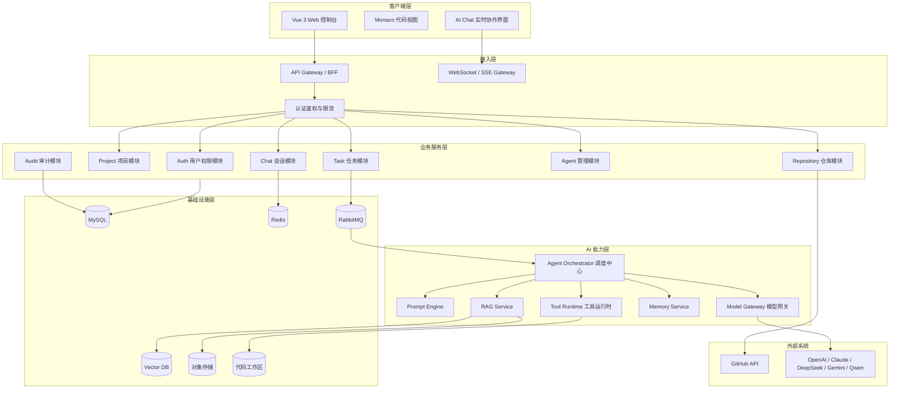
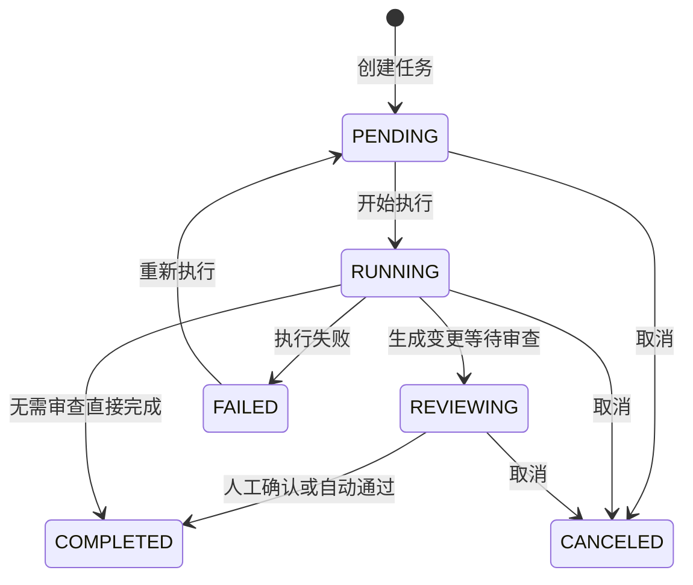
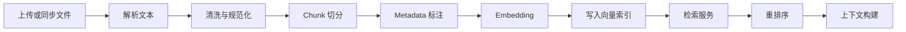
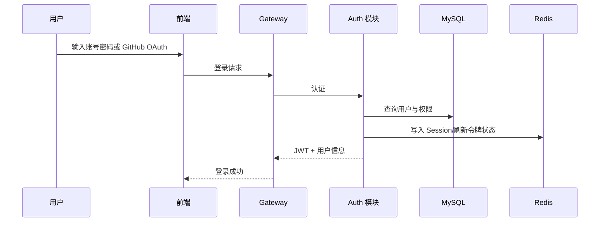
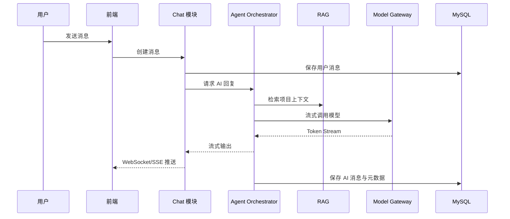
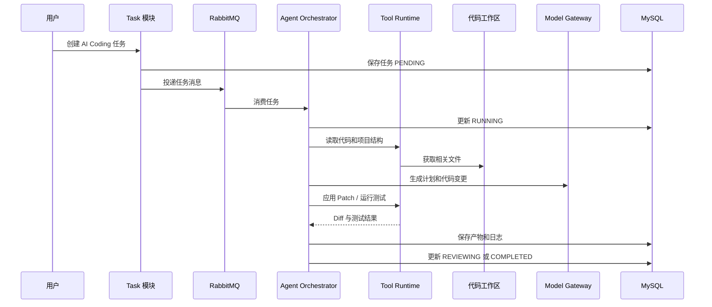
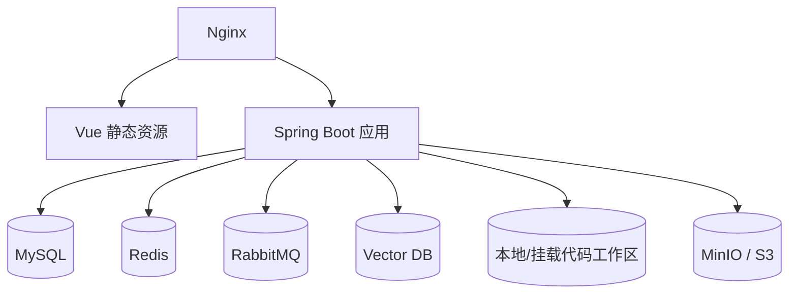
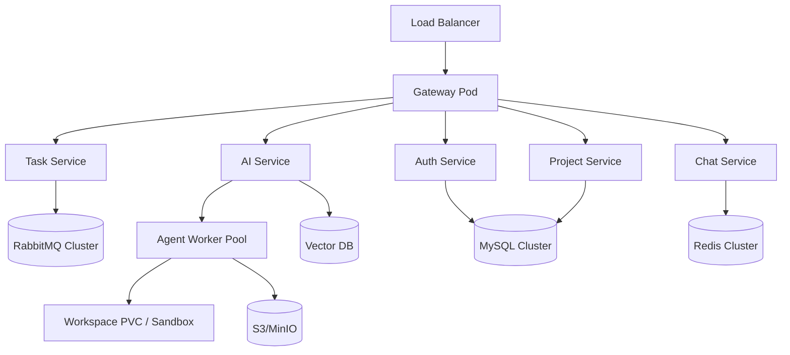

# AI Coding Platform 系统框架设计

## 1. 设计目标

AI Coding Platform 的系统框架目标是支撑企业团队在统一平台内完成“需求输入、AI 任务拆解、Agent 自动执行、代码变更、质量审查、PR 协作、知识沉淀”的完整研发闭环。

系统设计需要满足以下目标：

- 支持团队、项目、成员、权限、仓库、任务、Agent 和知识库统一管理。
- 支持多模型、多 Agent、多工具的可插拔扩展。
- 支持 AI Chat、AI Coding、RAG、GitHub 集成和自动化任务调度。
- 支持企业级安全隔离、审计、成本控制和可观测性。
- 支持从单体模块化架构平滑演进到微服务架构。

## 2. 总体架构

系统采用“前后端分离 + 模块化后端 + AI Agent 调度中心 + RAG 知识库 + 异步任务队列 + GitHub 集成”的整体架构。

第一阶段建议采用模块化单体或轻量服务拆分，降低早期复杂度；当团队规模、调用量和任务并发提升后，再逐步拆分为微服务。

## 3. 架构分层

### 3.1 客户端层

客户端层基于 Vue 3 + TypeScript + Vite + Element Plus 实现。

主要职责：

- 用户登录、项目工作台、任务看板、AI Chat、知识库、Agent 配置和仓库管理。
- 使用 WebSocket 或 SSE 展示 AI 流式输出。
- 使用 Monaco Editor 展示代码、Diff、Patch 和生成结果。
- 使用 Markdown Renderer 渲染 AI 输出。
- 对敏感操作提供明确确认，例如 Push、PR、删除知识库文件、取消任务。

### 3.2 接入层

接入层可以先由 Spring Boot BFF 模块承担，后续拆分为 Gateway 服务。

主要职责：

- REST API 统一入口。
- JWT 鉴权。
- RBAC 权限校验。
- 项目级资源访问控制。
- 接口限流。
- WebSocket/SSE 连接管理。
- 请求日志、Trace ID 注入和错误响应规范化。

### 3.3 业务服务层

业务服务层负责稳定的产品业务能力，包括用户、项目、任务、仓库、聊天、Agent 配置和审计。

设计原则：

- 业务模块之间通过清晰的应用服务接口交互。
- 项目 ID 是核心隔离边界，所有项目资源必须校验项目成员权限。
- AI 执行不直接阻塞 HTTP 请求，统一通过任务队列和执行日志异步处理。
- 所有关键状态变更必须记录审计日志。

### 3.4 AI 能力层

AI 能力层负责模型调用、Agent 编排、工具调用、Memory、RAG 和安全策略。

设计原则：

- 模型供应商通过 Model Gateway 统一适配。
- Prompt、工具权限、模型参数和 Agent 配置版本化管理。
- Agent 只通过 Tool Runtime 操作代码、Git、文件和外部系统。
- RAG 检索、Memory 注入和上下文裁剪由统一上下文构建器完成。
- 工具调用必须具备权限校验、输入校验、超时控制和审计记录。

### 3.5 基础设施层

基础设施层提供持久化、缓存、消息队列、向量检索、文件存储和代码工作区。

推荐组件：

- MySQL：业务数据、任务、消息、配置、审计。
- Redis：Session、验证码、限流、短期 Memory、流式输出缓存。
- RabbitMQ：AI 任务、RAG 解析、Git 操作、Review 任务异步队列。
- Vector DB：项目知识库向量索引。早期可使用 pgvector、Milvus、Qdrant 或 Elasticsearch 向量能力。
- 对象存储：上传文档、解析产物、任务附件。
- 代码工作区：每个项目或任务独立目录，执行 Clone、Patch、测试和 Diff。

## 4. 后端模块设计

### 4.1 Auth 模块

职责：

- 账号密码登录。
- GitHub OAuth 登录。
- 邮箱验证码登录。
- JWT 签发、刷新和失效。
- 用户、角色、权限管理。

核心设计：

- 使用 Spring Security 统一认证链路。
- 平台角色控制系统级能力。
- 项目角色控制项目内资源访问。
- GitHub OAuth Token 加密存储。

关键表：

- user。
- role。
- permission。
- user_role。
- github_account。

### 4.2 Project 模块

职责：

- 项目创建、编辑、归档。
- 项目成员管理。
- 项目配置管理。
- 项目级模型、Agent、Memory、RAG 配置。

核心设计：

- 项目是所有协作资源的核心聚合根。
- 所有任务、会话、知识库、仓库配置均归属于项目。
- 项目配置应支持版本变更记录，便于追溯 AI 行为差异。

关键表：

- project。
- project_member。
- project_config。
- project_agent_config。

### 4.3 Repository 模块

职责：

- GitHub OAuth 仓库列表读取。
- 仓库导入。
- Clone、Pull、Branch 查询。
- Commit、Push、PR 创建。
- Diff 和 Patch 管理。

核心设计：

- 所有 Git 写操作必须运行在隔离工作区。
- 每个 AI 任务应创建独立任务分支或临时工作目录。
- Commit/Push/PR 属于高风险操作，必须具备权限校验和操作确认。
- Git 操作日志必须记录操作者、分支、Commit Hash、任务 ID 和状态。

### 4.4 Chat 模块

职责：

- 会话管理。
- 消息存储。
- AI 流式输出。
- 多 Agent 输出聚合。
- 引用来源与上下文展示。

核心设计：

- 用户消息和 AI 消息统一保存到 chat_message。
- 流式输出过程可先写 Redis Stream，再异步落库。
- 每条 AI 回复需要关联模型、Agent、Token 用量、上下文摘要和引用来源。
- 支持会话级 Memory 和项目级 Memory 组合注入。

### 4.5 Task 模块

职责：

- AI 任务创建。
- 任务状态流转。
- Agent 指派。
- 任务队列投递。
- 执行日志和产物管理。

状态机：

核心设计：

- 任务状态只能通过状态机合法流转。
- 任务执行日志使用 append-only 方式追加。
- 任务产物包括文本结果、代码 Patch、生成文件、测试报告、Review 报告。
- 失败任务应保存失败阶段、错误堆栈摘要和可重试建议。

### 4.6 Agent 管理模块

职责：

- Agent 类型管理。
- Agent Prompt 配置。
- Agent 模型配置。
- Agent 工具权限配置。
- Agent 版本管理。

核心设计：

- Agent = 角色定义 + 模型配置 + Prompt 模板 + 工具白名单 + 执行策略。
- 不同项目可以启用不同 Agent 配置。
- Agent 配置变更需要版本号，任务执行时绑定当时版本。

内置 Agent：

- Architect Agent。
- Backend Agent。
- Frontend Agent。
- Test Agent。
- Review Agent。
- DevOps Agent。

### 4.7 RAG 模块

职责：

- 文档上传。
- 文档解析。
- Chunk 切分。
- Embedding 生成。
- 向量检索。
- 混合检索。
- 重排序。

核心设计：

- 文档解析和向量化通过异步任务执行。
- Chunk 需要保存项目 ID、文件 ID、文件路径、语言、标题、行号、更新时间等 Metadata。
- 代码检索应结合关键词检索、路径过滤、符号索引和向量检索。
- AI 输出引用知识库内容时需要返回来源。

### 4.8 Audit 与 Monitor 模块

职责：

- 关键操作审计。
- AI 调用日志。
- Token 统计。
- 成本统计。
- 任务监控。
- 系统告警。

核心设计：

- 记录谁在什么项目中让哪个 Agent 使用了哪个模型和工具。
- 记录模型输入输出摘要，敏感内容需要脱敏。
- 记录工具调用参数、结果、耗时和失败原因。
- 支持按用户、项目、Agent、模型统计 Token 和成本。

## 5. AI 核心框架设计

### 5.1 Agent Orchestrator

Agent Orchestrator 是 AI 执行中枢，负责任务编排、上下文构建、模型调用、工具调用和状态同步。

执行步骤：

1. 领取任务。
2. 加载任务详情、项目配置、Agent 配置和权限上下文。
3. 构建上下文，包括需求、项目 Memory、RAG 检索结果、相关代码、历史任务和约束。
4. 生成执行计划。
5. 调用模型进行推理。
6. 根据模型输出调用工具。
7. 写入执行日志和中间状态。
8. 生成最终产物。
9. 按风险等级进入完成、Review 或失败状态。

### 5.2 Model Gateway

Model Gateway 统一适配多模型供应商。

接口能力：

- Chat Completion。
- Streaming。
- Embedding。
- Tool Calling。
- JSON/结构化输出。
- 模型健康检查。
- 模型降级。

设计要求：

- 统一请求与响应结构。
- 支持项目级默认模型。
- 支持 Agent 级覆盖模型。
- 支持超时、重试、限流和熔断。
- 记录 Token、耗时、错误码和成本。

### 5.3 Prompt Engine

Prompt Engine 管理系统 Prompt、Agent Prompt、任务 Prompt 和模板变量。

设计要求：

- Prompt 模板版本化。
- Prompt 变量显式定义。
- Prompt 输出格式可约束为 JSON Schema。
- 支持安全规则注入，例如禁止越权访问、禁止泄露密钥、敏感操作需确认。
- 支持 Prompt 变更审计和回滚。

### 5.4 Tool Runtime

Tool Runtime 是 Agent 调用外部能力的唯一入口。

工具分类：

- 文件工具：读取文件、写入 Patch、查看目录。
- 代码工具：运行测试、构建、静态检查。
- Git 工具：Diff、Commit、Push、Create PR。
- RAG 工具：检索文档、检索代码。
- 通知工具：任务通知、评论通知。
- DevOps 工具：构建部署、环境检查。

工具治理：

- 工具白名单。
- 项目权限校验。
- 参数 Schema 校验。
- 超时控制。
- 沙箱或工作区隔离。
- 审计日志。
- 敏感工具人工确认。

### 5.5 Memory Service

Memory 分为短期记忆、项目记忆和长期决策记忆。

| 类型 | 存储 | 用途 |
| --- | --- | --- |
| Session Memory | Redis + MySQL | 当前会话上下文 |
| Project Memory | MySQL + Vector DB | 项目约定、技术栈、关键文件、业务规则 |
| Decision Memory | MySQL | AI 决策、架构取舍、任务总结 |
| User Preference | MySQL | 用户偏好、常用模型、输出风格 |

设计要求：

- Memory 写入需要分类和可信度标记。
- 长期 Memory 应支持人工确认或自动摘要。
- 上下文注入时需要按权限、相关性和 Token 预算筛选。

## 6. RAG 框架设计

### 6.1 数据来源

- GitHub 仓库代码。
- README、Markdown、接口文档。
- PDF、Word 文档。
- 历史任务和 AI 执行结果。
- PR Review 结论。
- 项目配置和技术规范。

### 6.2 处理流水线

### 6.3 检索策略

- 文档问答：向量检索 + 重排序。
- 代码理解：路径过滤 + 关键词检索 + 符号索引 + 向量检索。
- Bug 修复：错误日志关键词 + 相关文件向量检索 + 依赖调用链。
- PR Review：Diff 片段 + 相关规范 + 相邻代码 + 历史问题。

### 6.4 Chunk 设计

文档 Chunk：

- 按标题、段落和语义边界切分。
- 保留文件名、标题路径、页码和段落位置。

代码 Chunk：

- 按类、方法、组件、函数、配置块切分。
- 保留语言、路径、符号名、起止行、依赖关系。

## 7. 核心业务流程设计

### 7.1 用户登录流程

### 7.2 AI Chat 流程

### 7.3 AI Coding 任务流程

### 7.4 GitHub PR 流程

1. 用户在任务详情页查看 AI 生成的 Diff。
2. 用户确认变更范围。
3. Repository 模块创建任务分支。
4. 系统 Commit 并 Push。
5. 系统调用 GitHub API 创建 PR。
6. Review Agent 自动分析 PR Diff。
7. PR Review 结果保存到平台并可同步为 GitHub 评论。

## 8. 数据架构设计

### 8.1 数据分类

| 数据类型 | 示例 | 存储 |
| --- | --- | --- |
| 业务数据 | 用户、项目、任务、Agent、权限 | MySQL |
| 实时数据 | Session、流式输出、限流计数 | Redis |
| 异步消息 | AI 任务、RAG 解析、Git 操作 | RabbitMQ |
| 知识数据 | 文档 Chunk、代码 Chunk、Embedding | Vector DB + MySQL |
| 文件数据 | 上传文档、任务附件、报告 | 对象存储 |
| 代码数据 | Clone 仓库、任务工作区、Patch | 文件系统/对象存储 |
| 审计数据 | 登录、工具调用、Git 写操作、模型调用 | MySQL/日志平台 |

### 8.2 数据隔离原则

- 所有业务表必须包含 project_id 或可追溯到 project_id。
- 查询项目资源必须校验当前用户是否为项目成员。
- 向量检索必须带 project_id 过滤条件。
- Agent 工具调用必须携带 user_id、project_id、task_id 和 agent_id。
- GitHub Token、模型 API Key 等敏感数据必须加密存储。

## 9. 安全框架设计

### 9.1 认证与授权

- 使用 JWT 作为 API 访问凭证。
- 使用 Refresh Token 支持登录续期。
- 使用 Spring Security 统一认证鉴权。
- 平台级权限采用 RBAC。
- 项目级权限采用 Project Role。

项目角色建议：

| 角色 | 权限范围 |
| --- | --- |
| Owner | 项目配置、成员管理、仓库配置、敏感操作审批 |
| Maintainer | 管理任务、执行 AI Coding、创建 PR |
| Developer | 创建任务、AI Chat、查看知识库和任务产物 |
| Viewer | 只读查看项目、聊天和任务结果 |

### 9.2 Agent 权限隔离

- Agent 不能直接访问数据库和文件系统。
- Agent 只能通过 Tool Runtime 调用工具。
- 工具必须按 Agent、用户、项目、任务进行权限校验。
- 写文件、Commit、Push、创建 PR、部署等高风险工具需要审批。
- 不同项目的代码工作区物理隔离。

### 9.3 Prompt 注入防御

- 系统 Prompt 注入明确安全边界。
- RAG 内容作为非可信上下文处理。
- 禁止执行文档中要求泄露密钥、跳过权限、修改安全策略的指令。
- 工具调用参数由 Schema 校验。
- 输出前进行敏感信息检测。

### 9.4 审计要求

必须审计：

- 登录、退出、OAuth 授权。
- 项目成员和权限变更。
- Agent 配置变更。
- 模型 API Key 配置变更。
- AI 任务执行。
- 工具调用。
- Git 写操作。
- PR Review 和部署操作。

## 10. 部署架构

### 10.1 MVP 部署方案

MVP 阶段建议采用简单可靠的部署方式：

特点：

- 后端先采用模块化单体。
- AI 任务 Worker 可与主应用同进程，也可单独启动。
- Vector DB 可选择轻量方案。
- 便于快速完成端到端闭环。

### 10.2 企业级部署方案

企业级阶段建议部署到 Kubernetes：

特点：

- AI Worker 独立扩缩容。
- Chat/WebSocket 服务独立扩缩容。
- RAG 解析任务独立 Worker。
- 模型网关支持限流、熔断和降级。
- 通过日志、指标、链路追踪统一观测。

## 11. 技术选型建议

| 领域 | 建议选型 | 说明 |
| --- | --- | --- |
| 后端 | Java 17 + Spring Boot 3 | 符合企业级开发和原始需求 |
| 安全 | Spring Security + JWT | 成熟、可扩展 |
| ORM | MyBatis-Plus | 快速开发 CRUD 和分页 |
| 数据库 | MySQL 8 | 核心业务数据 |
| 缓存 | Redis | Session、限流、短期 Memory |
| 队列 | RabbitMQ | 任务异步和削峰 |
| AI 框架 | LangChain4j + Spring AI | Java 生态内集成模型、工具和 RAG |
| 前端 | Vue 3 + TypeScript + Vite | 研发效率高 |
| UI | Element Plus | 企业后台适配 |
| 编辑器 | Monaco Editor | 代码查看、Diff 和 Patch |
| 向量库 | Qdrant / Milvus / pgvector | 依据部署复杂度选择 |
| 对象存储 | MinIO / S3 | 文档和任务产物 |
| 部署 | Docker Compose -> Kubernetes | 先快后稳，支持演进 |

## 12. 演进路线

### 阶段一：模块化单体闭环

目标：

- 完成用户、项目、GitHub、AI Chat、任务和基础 Agent 执行闭环。

架构形态：

- 一个 Spring Boot 后端。
- 一个 Vue 前端。
- MySQL + Redis + RabbitMQ + Vector DB。
- 内置 Agent Worker。

### 阶段二：AI 能力独立化

目标：

- 强化 Agent、RAG、AI Coding 和 Review 能力。

架构形态：

- AI Service 与 Agent Worker 独立运行。
- RAG 解析 Worker 独立运行。
- Model Gateway 抽象多模型调用。
- Tool Runtime 独立治理工具权限。

### 阶段三：微服务和企业治理

目标：

- 支持大规模团队、多项目、多租户和企业治理。

架构形态：

- Gateway、Auth、Project、Task、Chat、AI、RAG、Repository 独立服务。
- Kubernetes 部署。
- 独立监控、审计、成本中心和插件系统。

## 13. 关键架构决策

### 13.1 先模块化单体，后微服务

决策：

- 第一阶段采用模块化单体，按服务边界组织包结构和数据库表。
- 当并发、团队规模和部署复杂度提升后，再拆分微服务。

原因：

- 早期需求多、变化快，模块化单体更适合快速迭代。
- AI Coding 平台的复杂度主要来自 AI 编排、权限和工具治理，过早微服务会增加联调成本。
- 清晰模块边界可以保留后续拆分空间。

### 13.2 AI 任务统一异步执行

决策：

- AI Coding、RAG 解析、PR Review、Git 写操作全部通过任务队列异步执行。

原因：

- 模型调用和代码操作耗时不可控。
- 异步架构更容易支持重试、取消、日志推送和限流。
- 避免 HTTP 请求长时间阻塞。

### 13.3 Agent 通过工具运行时访问能力

决策：

- Agent 不能直接操作文件系统、Git、数据库和外部 API，必须通过 Tool Runtime。

原因：

- 统一权限控制和审计。
- 降低 Prompt 注入风险。
- 便于工具扩展、限流、超时和沙箱治理。

### 13.4 RAG 检索必须带项目隔离

决策：

- 所有知识库索引和检索必须带 project_id 过滤。

原因：

- 防止跨项目数据泄露。
- 支持项目级知识库、Memory 和权限模型。
- 便于后续演进到组织级和租户级隔离。

## 14. 待细化问题

- 向量数据库最终选型：Qdrant、Milvus、pgvector 或 Elasticsearch。
- 代码工作区隔离方式：本地目录、容器沙箱、Kubernetes Job 或 Firecracker。
- Agent 多步执行是否采用工作流引擎，例如 Temporal、Flowable 或自研状态机。
- Prompt、Agent 配置和模型参数是否需要完整发布审批流程。
- 是否从第一阶段开始支持组织/租户模型。
- 模型 API Key 使用平台统一 Key，还是支持用户和项目自带 Key。

## 15. 总结

本系统框架以“项目”为核心边界，以“AI 任务”为执行主线，以“Agent Orchestrator + Model Gateway + Tool Runtime + RAG + Memory”为 AI 能力底座。第一阶段建议先完成模块化单体闭环，保证登录、项目、仓库、AI Chat、任务和 Agent 执行可用；第二阶段强化 AI Coding、RAG 和 Review；第三阶段再演进到微服务、Kubernetes、多 Agent 协同和企业级治理。

